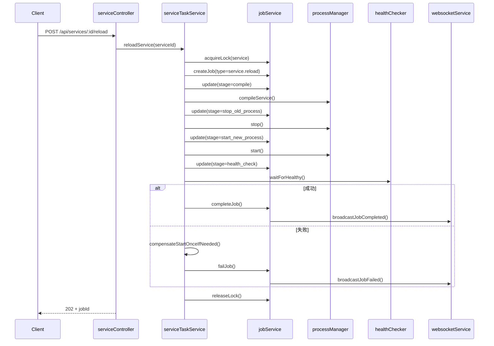

# AI 自动化服务控制后端 Design

## Spec Metadata

- 类型：Feature Spec
- Workflow：Design-First
- 对应需求：`.kiro/specs/ai-service-automation-backend/requirements.md`
- 来源文档：
  - `docs/ai-service-automation-implementation-plan.md`
  - `docs/ai-service-automation-api.md`
  - `docs/ai-service-automation-operations-supplement.md`

## 1. 设计目标

在不推翻现有 `metersphere-control-panel` 架构的前提下，为服务控制与前端构建补齐统一任务中心、异步查询入口、服务 `reload` 编排、Redis 持久化、资源锁、恢复扫描和统一 WebSocket 任务事件。

设计原则：

- 确定性优先：宁可流程显式一些，也不依赖隐式热替换推断
- 最小侵入：延续现有 `routes -> controllers -> services` 分层
- 渐进迁移：先接入统一任务中心，再逐步迁移现有构建与重启能力
- 兼容优先：兼容现有 `buildId`、`service:status`、`build:*` 语义

## 2. 当前代码映射

现有基础能力：

- `backend/routes/services.js`：服务控制路由
- `backend/controllers/serviceController.js`：服务控制入口
- `backend/controllers/buildController.js`：构建入口
- `backend/services/processManager.js`：服务启停、构建执行、取消构建
- `backend/services/buildProgressService.js`：构建进度与历史
- `backend/services/websocketService.js`：实时事件广播
- `backend/services/healthChecker.js`：健康检查能力

缺口：

- 只有构建领域具备 `buildId`
- 没有统一 `jobId`
- `serviceController` 仍直连 `processManager`
- 缺少 `reload` 编排层
- 没有真实分布式锁和 Redis 恢复模型

## 3. 架构概览

```text
Client / AI Agent / Control Panel UI
            |
            v
      Route -> Controller
            |
            v
   Orchestration Services
   - serviceTaskService
   - jobService
            |
   +--------+---------+
   |                  |
   v                  v
processManager   buildProgressService
   |                  |
   v                  v
Service Processes   Build Execution
            |
            v
      healthChecker

Shared state and coordination:
- Redis jobs
- Redis locks
- recovery scan
- rate limiting
- websocket job events
```

这张图强调两件事：

- controller 负责入口和响应，不再承担长任务编排
- `jobService + serviceTaskService` 是统一任务模型的核心收敛点

详细交互时序见后文 `reload` 流程序列图。

## 4. 目标分层

### 4.1 路由层

职责：

- URL 映射
- 挂载 controller
- 不直接包含业务逻辑

新增：

- `backend/routes/jobs.js`
- `POST /api/services/:id/reload`

### 4.2 Controller 层

职责：

- 参数解析与校验
- 调用编排服务
- 输出 HTTP 状态码与响应体

改造：

- `serviceController` 不再直接编排长任务，只委托给 `serviceTaskService`
- `buildController` 在创建构建任务时同步创建统一 job，并保持 `buildId` 兼容字段
- 新增 `jobController` 统一查询任务

### 4.3 Orchestration Service 层

新增：

- `backend/services/jobService.js`
- `backend/services/serviceTaskService.js`

职责：

- 创建、推进、完成、失败、取消任务
- 获取、释放、续期资源锁
- 组织 `reload` / `restart` / `start` / `stop` / batch 任务流程
- 汇总阶段进度并广播 `job:*` 事件
- 执行失败补偿与恢复收敛

### 4.4 Process Service 层

沿用并扩展 `processManager`：

- 真正执行系统命令
- 启停服务进程
- 触发前端模块构建
- 取消构建
- 新增 `compileService()` 和统一 `_runCommand()`
- 强制使用绝对可执行路径与显式 `cwd`

### 4.5 State / Progress 层

- `jobService`：统一任务状态、活动任务、历史、锁、恢复扫描
- `buildProgressService`：保留前端构建明细，作为构建领域扩展视图

## 5. 核心数据模型

### 5.1 Job

```json
{
  "jobId": "job_01J...",
  "type": "service.reload",
  "targetType": "service",
  "targetId": "gateway",
  "status": "running",
  "stage": "health_check",
  "progress": 80,
  "message": "等待健康检查通过",
  "startedAt": "2026-03-08T12:00:00.000Z",
  "finishedAt": null,
  "error": null,
  "result": null,
  "metadata": {
    "serviceId": "gateway"
  }
}
```

必要字段：

- 标识：`jobId`、`type`、`targetType`、`targetId`
- 生命周期：`status`、`stage`、`progress`、`message`
- 时间：`createdAt`、`startedAt`、`finishedAt`
- 诊断：`error`、`result`、`metadata`
- 批量：`parentJobId`、`subJobs`、`summary`

### 5.2 Redis Key 设计

```text
job:{jobId}
job:active
job:history
job:index:target:{targetType}:{targetId}
lock:service:{serviceId}
lock:module:{moduleId}
lock:batch:services
rate:service:{serviceId}
```

TTL 建议：

- `job:{jobId}`：24h
- 失败任务明细：72h
- 历史列表：最近 200 条
- `lock:*`：10 分钟，长任务按阶段续期
- `rate:*`：30 秒限流窗口

### 5.3 锁值结构

```json
{
  "jobId": "job_01J...",
  "type": "service.reload",
  "targetId": "gateway",
  "createdAt": "2026-03-08T12:00:00.000Z"
}
```

锁约束：

- 用 `SET key value NX EX ttl` 获取锁
- 只有持锁 `jobId` 可以解锁
- 执行超过窗口时必须续期
- Redis 不可用时不允许退化到内存锁

## 6. API 与响应设计

### 6.1 查询接口

- `GET /api/jobs/:jobId`
- `GET /api/jobs/active`
- `GET /api/jobs/history/recent`
- `POST /api/jobs/:jobId/cancel`（保留为后续扩展；阶段 1 可只保留构建取消）

查询接口统一返回 `200`。

### 6.2 长耗时写接口

统一使用 `202 Accepted`：

- `POST /api/services/:id/reload`
- `POST /api/services/:id/restart`（迁移后）
- `POST /api/services/:id/start` / `stop`（迁移后）
- `POST /api/build/frontend`
- `POST /api/build/frontend/batch`

统一响应骨架：

```json
{
  "success": true,
  "jobId": "job_01J...",
  "buildId": "build_...",
  "message": "任务已创建"
}
```

其中 `buildId` 仅在构建兼容期返回。

### 6.3 结构化错误响应

```json
{
  "success": false,
  "error": {
    "code": "SERVICE_BUSY",
    "message": "服务正在处理中，请稍后再试",
    "details": {
      "serviceId": "gateway",
      "stage": "checking_health"
    }
  }
}
```

状态码约定：

- `400`：参数错误
- `404`：目标不存在
- `409`：资源忙 / 锁冲突
- `429`：触发限流
- `503`：Redis 不可用
- `500`：系统内部错误

## 7. 关键流程设计

### 7.1 reload 流程



阶段建议：

- `prepare`
- `compile`
- `stop_old_process`
- `start_new_process`
- `health_check`
- `compensation_start`（必要时）
- `completed` / `failed`

### 7.2 restart 流程

与 `reload` 类似，但跳过 `compile` 阶段：

- `prepare`
- `stop_old_process`
- `start_new_process`
- `health_check`

### 7.3 build 流程

构建继续沿用 `buildProgressService` 的领域能力，但在入口处新增统一 job：

1. `buildController` 创建 `job`
2. `buildProgressService` 记录 `buildId`
3. 构建阶段推进时同步更新 `jobService`
4. 兼容广播原有 `build:*` 事件
5. 可选自动重启关联服务时需申请模块锁 / 关联服务锁

## 8. 健康检查与补偿策略

### 8.1 健康检查

优先级：

1. 服务配置中的 `healthCheck`
2. 默认 `/actuator/health`
3. 未配置时退化为端口探测

成功条件：

- HTTP 200
- 响应体包含 `UP`
- 单次响应时间 < 5 秒

失败与重试：

- 可重试：连接拒绝、5xx、超时
- 立即失败：404、端口占用、配置错误
- 默认每 3 秒探测一次
- `restart` / `reload` 最多 40 次
- 补偿启动最多 20 次

### 8.2 补偿启动

触发条件：

- `stop_old_process` 成功后 `start_new_process` 失败
- `start_new_process` 成功后 `health_check` 超时或失败

规则：

- 每个 `reload` 任务最多补偿一次
- 补偿期间继续持有原服务锁
- 补偿日志必须标记 `compensation: true`
- 补偿成功后将任务收敛到 `recovered` / `recovered_degraded`
- 补偿失败后收敛到 `failed_service_down`

## 9. Redis 可用性与恢复扫描

### 9.1 Redis 可用性策略

- 创建任务前 Redis 不可用：拒绝任务，返回 `503 REDIS_UNAVAILABLE`
- 执行中 Redis 短暂抖动：停止接收新任务，写入与续期允许有限重试
- 明确禁止退化为纯内存任务中心或纯内存锁

### 9.2 恢复扫描

控制面板启动时：

1. 读取 `job:active`
2. 加载 `pending` / `running` 任务
3. 结合真实服务状态或构建状态执行收敛
4. 结果收敛为 `succeeded_after_recovery`、`interrupted` 或 `recovery_pending`
5. 清理孤儿锁
6. 广播恢复后的任务状态

## 10. WebSocket 事件设计

新增统一事件：

- `job:progress`
- `job:completed`
- `job:failed`

兼容保留：

- `build:progress`
- `build:completed`
- `build:failed`
- `service:status`

广播原则：

- 任务状态更新由 `jobService` 统一触发
- controller 不直接拼 WebSocket 消息
- 恢复扫描、补偿启动、失败收敛都必须广播终态

## 11. 批量与限流策略

### 11.1 批量任务

- 父任务维护 `subJobs` 和汇总统计
- 默认按 `startOrder` 顺序执行
- 某个子任务失败时继续后续子任务
- 第一阶段不实现自动回滚

### 11.2 限流

- 基于 Redis `rate:service:{serviceId}` 控制重复写入
- 限流窗口默认 30 秒
- 只有真正进入 `running` 的任务计入窗口
- 参数错误、404、409、503 不计入限流

## 12. 文件级改动映射

新增：

- `backend/routes/jobs.js`
- `backend/controllers/jobController.js`
- `backend/services/jobService.js`
- `backend/services/serviceTaskService.js`

改造：

- `backend/routes/services.js`：新增 `POST /:id/reload`
- `backend/controllers/serviceController.js`：接入服务编排层
- `backend/controllers/buildController.js`：统一返回 `jobId`
- `backend/services/processManager.js`：新增 `compileService()`、统一命令执行 helper、绝对路径约束
- `backend/services/buildProgressService.js`：增加 `jobId` 关联
- `backend/services/websocketService.js`：新增 `job:*` 广播 helper
- `backend/server.js`：挂载 `/api/jobs`

## 13. 实施阶段

### 阶段 1 - 最小可用版本

- 引入 `jobService`
- 引入 `jobs` 查询路由
- 引入 `serviceTaskService`
- 打通 `POST /api/services/:id/reload`
- 在 `processManager` 中补 `compileService()` 和命令路径绝对化
- 引入 Redis 持久化、锁、恢复扫描、超时 / 健康检查基线

### 阶段 2 - 统一任务模型

- 将 `restart` / `start` / `stop` 迁移到统一任务编排
- 将 `buildController` / `buildProgressService` 迁移到统一 `jobId`
- 接入活动任务与最近任务查询列表
- 批量任务父子模型落地

### 阶段 3 - 收敛兼容层

- 统一 WebSocket 任务语义
- 收敛错误码体系与限流策略
- 缩减旧的 `buildId` / 旧事件依赖
- 完成更细粒度的批量和取消语义
