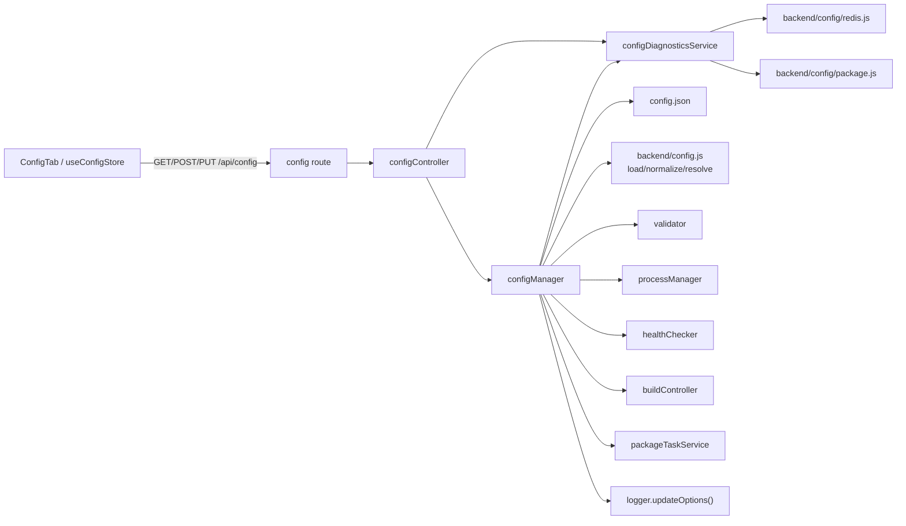
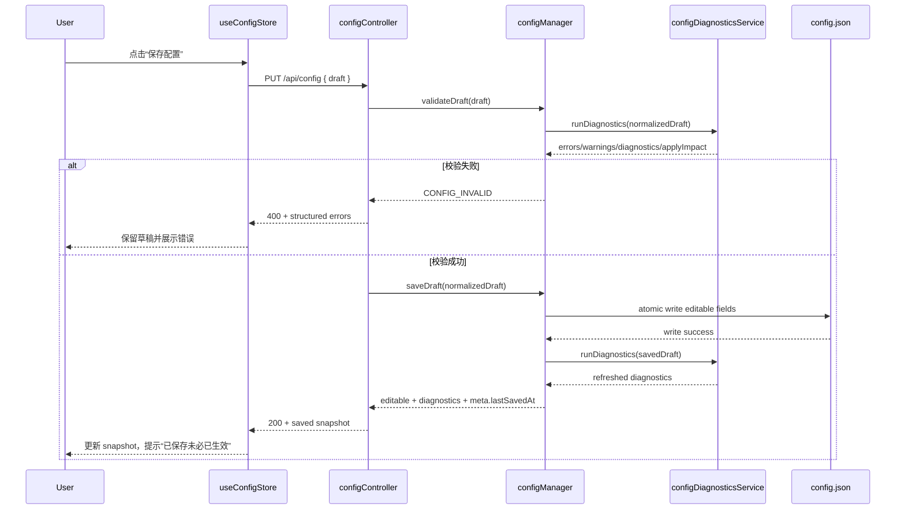
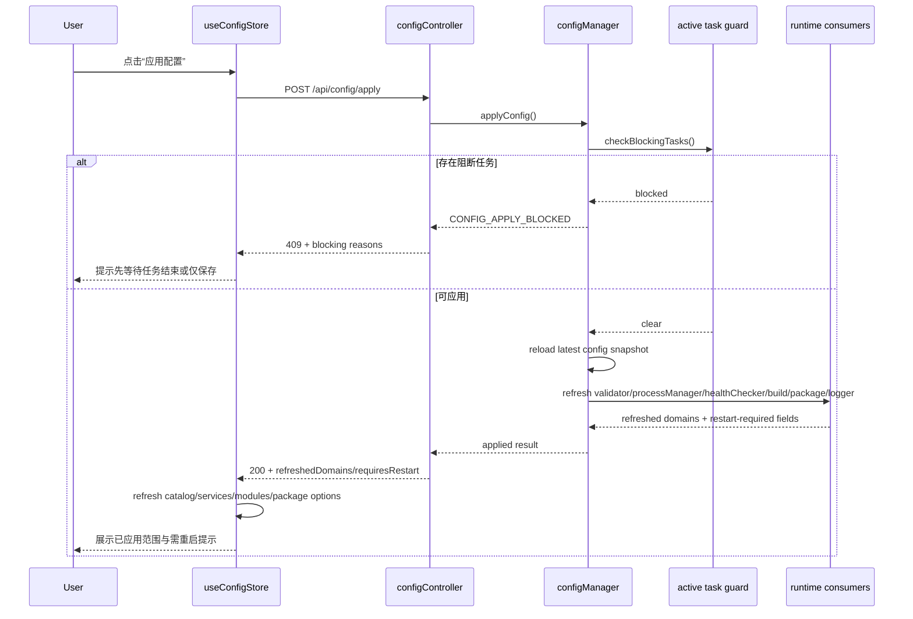

# 配置管理页 Design

## 1. 文档目的

本文档基于 `.kiro/specs/config-management-page/requirements.md`，为 `metersphere-control-panel` 的“配置管理”能力提供一个可落地的前后端实现方案。

目标不是引入一套新的配置平台，而是在当前仓库结构上，以最小破坏方式补齐以下能力：

- 配置查询
- 草稿编辑
- 校验
- 保存
- 应用
- 诊断

## 2. 当前实现现状与约束

### 2.1 当前配置来源

- `config.json`：控制面板主配置
- `backend/config.js`：读取 `config.json` 并派生 `serviceCatalog`、`frontendModules` 等结构
- `backend/config/redis.js`：从环境变量和 `MS_PROPERTIES_PATH` 指向的 properties 文件读取 Redis 配置
- `backend/config/package.js`：解析打包脚本候选路径与默认打包参数

### 2.2 当前代码约束

当前后端大量模块直接 `require('../config')` 并在模块初始化时缓存配置，这意味着：

1. 保存 `config.json` 不等于运行态已更新
2. 部分依赖配置的服务在进程启动后就固定了初始值
3. 若不改造单例消费方式，配置管理页会出现“保存成功但运行逻辑未变”的假成功

重点风险点：

- `backend/utils/validator.js`：模块加载时构造 `VALID_SERVICES` 和 `VALID_MODULES`
- `backend/services/processManager.js`：构造函数中固定 `this.projectRoot`
- `backend/services/healthChecker.js`、`backend/controllers/buildController.js`、`backend/services/packageTaskService.js`：直接依赖静态配置对象

## 3. 设计目标

### 3.1 设计原则

1. **持久配置与运行时配置分离**：只把 `config.json` 可持久项做成可编辑
2. **保存与应用分离**：保存只写盘，应用才尝试更新进程内快照
3. **热应用保守化**：不承诺所有字段热生效，端口等 server 级配置明确提示需重启
4. **动态读取替代静态单例**：配置消费者在使用时读取最新快照
5. **诊断优先**：先让用户知道“为什么不能启动 / 不能构建 / 不能打包”

### 3.2 非目标

- 不重构整个后端为依赖注入框架
- 不在本阶段实现多配置文件或多环境编排
- 不实现在线编辑 `.env` 或 shell profile

### 3.3 正确性属性

以下属性作为实现验收和属性测试设计的基础，用于约束“校验 / 保存 / 应用”链路的核心行为。

#### Property 1：保存与应用一致性

对于任意通过校验的草稿 `D`，若 `saveDraft(D)` 成功，且随后 `applyConfig()` 在无阻断任务的情况下成功完成，则 `getResolvedConfig()` SHALL 反映 `D` 的标准化结果；对无法热应用的字段，系统 SHALL 在 `requiresRestart` 中显式返回，而不得静默丢失。

#### Property 2：校验纯函数语义

对于任意草稿 `D`，执行 `validateDraft(D)` SHALL NOT 修改磁盘上的 `config.json`，也 SHALL NOT 改变当前运行中的 `currentResolvedConfig`、活动任务上下文或日志配置。

#### Property 3：可编辑边界不变量

对于任意草稿 `D`，`saveDraft(D)` SHALL 仅持久化 editable 白名单内字段；所有 runtime 派生字段、环境变量覆盖字段以及 `../metersphere` 仓库内容 SHALL CONTINUE TO 保持不变。

#### Property 4：失败原子性

对于任意无效草稿或任意写盘失败场景，`saveDraft(D)` SHALL 返回结构化错误，并保持磁盘中的最后一个有效 `config.json` 与内存中的 `currentResolvedConfig` 不变。

#### Property 5：应用阻断安全性

对于任意应用请求 `A`，若存在阻断任务且改动字段命中受保护集合（例如 `projectRoot`、服务定义或打包脚本路径），`applyConfig()` SHALL 被拒绝，且所有运行时消费者 SHALL CONTINUE TO 使用应用前快照。

#### Property 6：来源与影响可解释性

对于任意返回给前端展示的配置项 `F`，系统 SHALL 能给出其来源标识与生效影响分类；若某字段需要重启生效，则该字段不得被归类为热应用成功。

## 4. 总体架构

### 4.1 新增领域

新增独立 `config` 领域：

- `backend/routes/config.js`
- `backend/controllers/configController.js`
- `backend/services/configManager.js`
- `backend/services/configDiagnosticsService.js`
- `frontend/src/components/ConfigTab.jsx`
- `frontend/src/store/useAppStore.js` 中新增 `useConfigStore`

### 4.2 职责划分

#### `configManager`

负责：

- 读取原始 `config.json`
- 规范化配置结构
- 生成 resolved config
- 保存配置到磁盘
- 应用最新配置到运行时可热更新消费者
- 提供元信息（加载时间、保存时间、文件路径）

#### `configDiagnosticsService`

负责：

- 校验 `projectRoot`
- 校验 `mvnw`
- 校验服务 `pom` 路径
- 校验端口合法性与冲突
- 校验打包脚本候选路径
- 汇总 Redis 与缓存状态
- 生成字段来源与应用影响说明

#### `configController`

负责：

- 校验请求体结构
- 调用 manager / diagnostics service
- 返回结构化 HTTP 响应

#### `useConfigStore`

负责：

- 管理配置页面草稿、诊断、校验、保存状态
- 将校验错误映射到各分区
- 协调保存 / 应用 / 重置 / 刷新诊断流程

### 4.3 架构关系图



说明：

- `configController` 保持薄控制器职责，只做请求校验、编排调用和响应整形。
- `configManager` 是唯一允许写入 `config.json` 和刷新运行时快照的领域服务。
- `configDiagnosticsService` 负责生成诊断、来源和应用影响说明，可被 `validate`、`save`、`get` 和 `diagnostics` 复用。
- 运行时消费者在改造后只通过 `configManager.getResolvedConfig()` 获取最新快照，避免模块初始化时缓存旧配置。

## 5. 数据模型

### 5.1 页面数据视图

后端对前端统一返回以下结构：

```json
{
  "editable": {
    "port": 3000,
    "projectRoot": "..",
    "maxLogLines": 1000,
    "package": {},
    "services": {}
  },
  "runtime": {
    "cache": {},
    "redis": {},
    "job": {},
    "timeouts": {},
    "envOverrides": {}
  },
  "resolved": {
    "projectRoot": "/abs/path/to/metersphere",
    "serviceCatalog": [],
    "frontendModules": [],
    "packageScriptCandidates": []
  },
  "diagnostics": {
    "projectRoot": {},
    "services": [],
    "ports": [],
    "packageScript": {},
    "redis": {}
  },
  "meta": {
    "configPath": "/abs/path/to/config.json",
    "lastLoadedAt": "...",
    "lastSavedAt": "...",
    "requiresRestartFields": ["port"],
    "hotApplySupportedFields": ["projectRoot", "services", "package.scriptPath", "maxLogLines"]
  }
}
```

### 5.2 可编辑配置范围

第一阶段仅允许编辑：

- `port`
- `projectRoot`
- `maxLogLines`
- `package.scriptPath` 及与 `config.json.package` 对齐的字段
- `services` 下各服务定义

第一阶段仅允许只读展示：

- `MS_CACHE_MODE`
- `MS_REDIS_*`
- `MS_JOB_*`
- `MS_SERVICE_*_TIMEOUT_*`
- `MS_PROPERTIES_PATH`
- `MS_PACKAGE_SCRIPT_PATH` / `PACKAGE_SCRIPT_PATH`

## 6. 后端 API 设计

### 6.1 `GET /api/config`

用途：加载配置页初始快照。

返回：

- `editable`
- `runtime`
- `resolved`
- `diagnostics`
- `meta`

说明：

- `editable` 用于初始化前端草稿
- `runtime` 用于只读展示 env 派生值
- `resolved` 用于展示最终生效快照
- `diagnostics` 用于诊断卡片

### 6.2 `POST /api/config/validate`

用途：对前端草稿做非落盘校验。

请求体：

```json
{
  "draft": {
    "port": 3000,
    "projectRoot": "../metersphere",
    "maxLogLines": 2000,
    "package": {},
    "services": {}
  }
}
```

返回：

```json
{
  "success": true,
  "data": {
    "valid": true,
    "errors": [],
    "warnings": [],
    "normalizedDraft": {},
    "diagnostics": {},
    "applyImpact": {
      "hotApply": [],
      "requiresRestart": []
    }
  }
}
```

### 6.3 `PUT /api/config`

用途：将可编辑配置持久化到 `config.json`。

说明：

- 保存前先做与 `validate` 同级别校验
- 仅持久化允许编辑的字段
- 保留兼容字段结构，不重命名现有配置键

返回：

- 保存后的 `editable`
- 最新 `diagnostics`
- `meta.lastSavedAt`

### 6.4 `POST /api/config/apply`

用途：将磁盘中的最新配置应用到当前进程支持热更新的消费者。

行为：

1. 检查是否存在阻断应用的活动任务
2. 重新装载配置快照
3. 更新支持动态刷新的服务
4. 返回热应用结果和重启提示

返回：

```json
{
  "success": true,
  "data": {
    "applied": true,
    "refreshedDomains": ["configManager", "validator", "processManager", "buildControllerDeps"],
    "requiresRestart": ["port"],
    "warnings": []
  }
}
```

### 6.5 `GET /api/config/diagnostics`

用途：重新执行诊断，不改变配置。

适用：

- 用户手动点击“重新检测”
- 保存后或应用后刷新诊断卡片

## 7. 配置管理核心实现

### 7.1 `configManager` 设计

建议接口：

- `getRawConfig()`：读取原始 JSON
- `getEditableConfig()`：返回前端可编辑结构
- `getRuntimeConfig()`：返回运行时只读结构
- `getResolvedConfig()`：返回最终解析快照
- `validateDraft(draft)`：返回错误、警告和标准化结果
- `saveDraft(draft)`：写入磁盘并返回最新快照
- `applyConfig()`：应用到支持动态更新的消费者
- `getMeta()`：返回时间戳和文件路径信息

内部状态：

- `currentRawConfig`
- `currentResolvedConfig`
- `lastLoadedAt`
- `lastSavedAt`

### 7.2 `backend/config.js` 重构策略

当前问题是文件导出一个一次性对象。

建议改为：

1. 导出纯函数：
   - `loadConfigFromFile()`
   - `normalizeConfig(rawConfig)`
   - `resolveProjectRoot(projectRootConfig, services)`
2. 由 `configManager` 调用这些纯函数生成快照
3. 旧消费者逐步迁移到 `configManager.getResolvedConfig()`

### 7.3 运行时消费者改造

#### `validator`

改造前：

- 模块加载时固定 `VALID_SERVICES` / `VALID_MODULES`

改造后：

- 每次校验时从 `configManager.getResolvedConfig()` 读取 `serviceCatalog` / `frontendModules`

#### `processManager`

改造前：

- 构造函数固定 `this.projectRoot`

改造后：

- 新增 `_getProjectRoot()` 和 `_getServiceConfig(serviceId)`，按调用时读取最新快照
- 若配置应用后 `projectRoot` 变化，新发起的控制任务使用新路径；已运行任务继续按旧上下文执行

#### `buildController` / `packageTaskService` / `healthChecker`

改造方式：

- 从静态 `config` 改为调用 `configManager.getResolvedConfig()`
- 避免在模块顶层缓存与配置强绑定的集合或路径

#### `logger`

新增：

- `updateOptions({ maxLogLines })`

说明：

- 允许 `maxLogLines` 在应用配置后更新

## 8. 前端页面设计

### 8.1 页签接入

在现有页签体系中新增 `config`：

- `frontend/src/App.jsx`
- `frontend/src/components/Sidebar.jsx`

新增后页签顺序建议为：

1. 前端构建
2. 服务管理
3. 整体验证打包
4. 配置管理

### 8.2 组件拆分

新增组件：

- `ConfigTab.jsx`：页面容器
- `ConfigGeneralSection.jsx`：基础设置
- `ConfigServicesSection.jsx`：服务配置
- `ConfigPackageSection.jsx`：构建与打包
- `ConfigRuntimePanel.jsx`：运行时只读信息
- `ConfigDiagnosticsPanel.jsx`：配置诊断
- `ConfigSaveBar.jsx`：校验 / 保存 / 应用 / 重置操作栏

设计原则：

- 表单编辑与诊断展示分离
- 服务列表采用表格 + 抽屉 / 弹窗编辑
- 操作按钮固定在底部，避免长页面滚动后无法保存

### 8.3 Zustand 状态模型

在 `useAppStore.js` 中新增 `useConfigStore`。

建议状态：

- `snapshot`：最近一次后端确认的配置快照
- `draft`：当前页面编辑草稿
- `diagnostics`：当前诊断结果
- `validation`：校验错误与警告
- `dirtyFields`：脏字段集合
- `loading`
- `saving`
- `applying`
- `lastSavedAt`
- `applyImpact`

建议 action：

- `fetchConfig()`
- `updateDraft(path, value)`
- `addService()`
- `updateService(serviceId, patch)`
- `removeService(serviceId)`
- `validateDraft()`
- `saveConfig()`
- `applyConfig()`
- `resetDraft()`
- `refreshDiagnostics()`

## 9. 关键交互流程

### 9.1 页面初始化

1. 进入 `ConfigTab`
2. 调用 `GET /api/config`
3. 设置 `snapshot`、`draft`、`diagnostics`
4. 渲染各分区

### 9.2 编辑与校验

1. 用户修改任意字段
2. 前端更新 `draft`
3. 页面进入 dirty 状态
4. 用户点击“校验配置”
5. 调用 `POST /api/config/validate`
6. 前端按字段展示错误 / 警告，并刷新诊断区

### 9.3 保存

1. 用户点击“保存配置”
2. 前端调用 `PUT /api/config`
3. 后端校验成功后写入 `config.json`
4. 返回标准化配置与保存时间
5. 前端更新 `snapshot`
6. 页面保留“尚未应用”或“部分需重启”提示

保存配置序列图：



### 9.4 应用

1. 用户点击“应用配置”
2. 后端检查活动任务
3. 若可应用，则重新装载配置并刷新运行时消费者
4. 返回已应用域和需重启提示
5. 前端触发 `fetchCatalog()`、`fetchServices()`、`fetchModules()`、`fetchPackageOptions()` 等刷新

应用配置序列图：



## 10. 错误处理策略

### 10.1 错误码建议

- `CONFIG_INVALID`
- `CONFIG_SAVE_FAILED`
- `CONFIG_APPLY_BLOCKED`
- `CONFIG_APPLY_PARTIAL`
- `CONFIG_DIAGNOSTIC_FAILED`

### 10.2 用户可见提示

- 字段级错误：直接展示在字段下方
- 区域级警告：显示在分区顶部
- 全局错误：使用 toast + 顶部错误摘要
- 高风险提示：修改 `projectRoot`、端口或删除服务时弹确认框

## 11. 应用边界与生效语义

### 11.1 可热应用字段

优先支持：

- `projectRoot`
- `services`
- `package.scriptPath`
- `maxLogLines`

### 11.2 需重启字段

明确标记：

- `port`

原因：

- 控制面板监听端口属于 server 级配置，修改后需要重新创建 HTTP server 才能生效

### 11.3 活动任务保护

以下情况建议阻止“应用配置”：

- 存在运行中的服务批量启动 / 停止 / 重启任务
- 存在前端构建任务正在执行
- 存在打包任务正在执行且本次修改涉及 `projectRoot` 或打包脚本路径

## 12. 验证方案

### 12.1 功能验证

- 能加载当前 `config.json` 并展示 resolved config
- 能识别无效 `projectRoot`
- 能识别打包脚本不存在或不可执行
- 能识别服务端口重复
- 能保存结构化服务配置
- 能在应用后刷新服务目录和模块目录

### 12.2 回归验证

- 原有服务管理 API 正常工作
- 原有前端构建 API 正常工作
- 原有打包页能力正常工作
- 原有 WebSocket 事件保持不变

## 13. 风险与缓解

### 风险 1：配置消费者遗漏迁移

后果：

- 部分模块仍使用旧快照，产生“已保存未生效”问题

缓解：

- 统一通过 `configManager.getResolvedConfig()` 访问配置
- 在任务中明确列出迁移清单

### 风险 2：活动任务中配置漂移

后果：

- 正在运行的控制任务与新配置不一致

缓解：

- 保存与应用分离
- 应用前检查任务状态，必要时阻断

### 风险 3：用户误以为 env 已被修改

后果：

- 页面显示与真实运行时预期不一致

缓解：

- 将 env 派生项设为只读
- 明确标记来源为环境变量

## 14. 分阶段落地建议

### 阶段 1

- 后端完成 `GET /api/config` 与 `POST /api/config/validate`
- 前端完成只读页面与草稿态编辑

### 阶段 2

- 后端完成 `PUT /api/config`
- 前端完成保存流程与错误展示

### 阶段 3

- 改造配置消费者为动态读取
- 后端完成 `POST /api/config/apply`
- 前端完成应用反馈与相关 store 刷新

### 阶段 4

- 增强诊断、导入导出、变更历史等扩展能力
