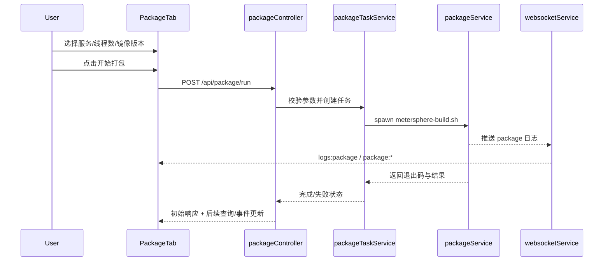
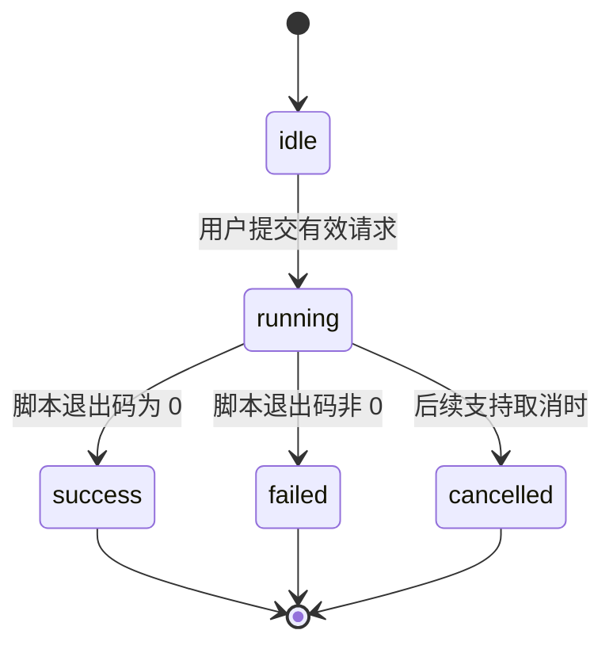

# Control Panel 打包页签 Design

## Spec Metadata

- 类型：Feature Spec
- Workflow：Requirements-First
- 关联需求：`.kiro/specs/control-panel-package-tab/requirements.md`

## 1. 设计目标

本设计的目标是在不修改 sibling `metersphere` 仓库脚本的前提下，把现有人工打包命令安全地接入控制面板。

设计原则：

- 最小侵入：尽量复用现有“构建任务 + 日志展示 + WebSocket 推送”模式
- 外部脚本隔离：控制面板只负责参数校验、进程执行和日志反馈，不复制脚本逻辑
- 配置显式：页面表单明确展示并允许指定本次执行的服务、线程数、镜像版本等核心参数
- 兼容优先：不影响现有两个标签页的交互和日志链路
- 可扩展：为后续增加更多脚本参数预留结构

## 2. 现状映射

现有前端结构：

- `frontend/src/App.jsx`：当前仅有 `build` 和 `services` 两个标签页
- `frontend/src/components/Sidebar.jsx`：侧边栏标签按钮定义
- `frontend/src/components/BuildTab.jsx`：已具备“表单 + 任务状态 + 日志展示”模式，可作为交互参考
- `frontend/src/components/LogViewer.jsx`：现有日志查看组件

现有后端基础：

- `backend/routes/build.js` / `backend/controllers/buildController.js`
- `backend/services/processManager.js`
- `backend/services/buildProgressService.js`
- `backend/services/jobService.js`
- `backend/services/websocketService.js`

外部脚本约束：

- 当前用户机器上的现有脚本路径为 `/Users/edy/ideaProjects/metersphere/打包/metersphere-build.sh`
- 控制面板实现层不应把这个绝对路径视为唯一运行前提，而应支持通过环境变量或配置项覆盖
- 脚本内已定义服务白名单：`gateway`、`eureka`、`test-track`、`api-test`、`performance-test`、`project-management`、`report-stat`、`system-setting`、`workstation`
- 常用参数当前来自环境变量：
  - `IMAGE_VERSION`
  - `PARALLEL_BUILD`
  - `MAX_JOBS`
- 脚本已稳定支持的高价值扩展参数还包括：
  - `BUILD_ONLY`
  - `PACKAGE_PATH`
- 目标服务通过位置参数传入，例如 `api-test`
- 脚本在未传任何位置参数时会默认构建全部模块，因此控制面板侧需要显式约束空选择行为

## 3. 推荐架构

```text
PackageTab (frontend)
    |
    v
POST /api/package/run
GET  /api/package/active
GET  /api/package/history/recent   (可选，阶段 2)
    |
    v
packageController
    |
    v
packageTaskService / packageService
    |
    v
spawn metersphere-build.sh [services...]
    |
    +--> logger / websocket
    +--> jobService / package progress state
```

设计重点：

- 不直接把脚本调用塞进 controller
- 推荐新增独立 `package` 领域，而不是复用 `buildController` 直接承载外部打包脚本
- 允许复用现有 `jobService` 和 WebSocket 事件机制

## 4. 前端设计

### 4.1 标签页结构

需要新增第 3 个标签页，例如：

- `build`：前端构建
- `services`：服务管理
- `package`：镜像打包

涉及位置：

- `frontend/src/App.jsx`
- `frontend/src/components/Sidebar.jsx`
- 新增 `frontend/src/components/PackageTab.jsx`
- 可能新增 `frontend/src/components/PackageTab.css`

### 4.2 页面布局

打包页签建议包含三块：

1. **打包配置区**
   - 目标服务下拉多选（来源于脚本白名单）
   - 镜像版本 `IMAGE_VERSION` 输入，并提供最近使用值
   - 并行构建开关 `PARALLEL_BUILD`
   - 线程数 `MAX_JOBS` 数字输入
   - 预留 `BUILD_ONLY` 开关和 `PACKAGE_PATH` 输入位
   - “开始打包”按钮

2. **执行状态区**
   - 当前状态：idle / running / success / failed / cancelled
   - 当前任务 ID（若复用 `jobService`）
   - 开始时间、结束时间、退出码

3. **日志区**
   - 展示本次打包 stdout/stderr
   - 尽量复用现有日志查看体验

### 4.3 服务与参数输入策略

第一阶段建议支持：

- 目标服务使用下拉多选
- 默认选中 `api-test`
- 若未选择任何服务，第一阶段默认禁止执行，并提示用户显式选择目标服务
- 线程数使用数字输入，默认值为 `4`
- 镜像版本可编辑，默认值为 `v2.10.26.09-lts`，并提供最近使用值
- 并行构建开关可切换，默认值为开启

预留后续扩展：

- “全部模块 / 全部服务”显式开关
- `BUILD_ONLY` 开关
- `PACKAGE_PATH` 输入
- 更多脚本参数配置
- 最近使用值的持久化策略与清理策略

## 5. 后端设计

### 5.0 脚本路径解析策略

建议优先级：

1. `MS_BUILD_SCRIPT_PATH` 环境变量
2. 基于控制面板当前配置推导 sibling `metersphere/打包/metersphere-build.sh`
3. 若以上均失败，则返回结构化错误并拒绝启动任务

这样做的原因是：

- 避免把实现绑定到单一开发者机器路径
- 兼容本地开发、共享机器和后续部署环境
- 与当前 spec 的 sibling 仓库边界保持一致，不要求修改外部脚本

### 5.1 路由与控制器

建议新增：

- `backend/routes/package.js`
- `backend/controllers/packageController.js`

第一阶段最小接口建议：

- `POST /api/package/run`
- `GET /api/package/active`（可选，但推荐）

`POST /api/package/run` 请求体建议：

```json
{
  "imageVersion": "v2.10.26.09-lts",
  "parallelBuild": true,
  "maxJobs": 4,
  "services": ["api-test"],
  "buildOnly": false,
  "packagePath": ""
}
```

### 5.2 服务层

建议新增：

- `backend/services/packageTaskService.js`
  - 负责任务创建、状态推进、并发保护
  - 推荐复用 `jobService` 的统一任务结构，任务类型建议固定为 `package.run`
- `backend/services/packageService.js`
  - 负责真正执行脚本、收集 stdout/stderr、回传退出码

之所以分两层：

- `packageTaskService` 负责控制面板语义
- `packageService` 负责外部脚本进程语义

这样后续更容易扩展：

- 历史记录
- 取消执行
- 多任务互斥
- 更多脚本参数

`jobService` 集成建议：

- 第一阶段即使用 `package.run` 作为标准任务类型，避免后续从临时状态模型迁移到统一任务模型时返工
- package 任务可沿用现有 `created -> running -> completed/failed` 结构，不需要为第一阶段单独扩展全新状态机
- package 专有字段（如服务列表、镜像版本、线程数）优先放入 `metadata`，避免修改 `jobService` 核心结构

### 5.3 进程执行方式

必须采用显式参数传递，而不是直接拼接整条 shell 命令。

建议方式：

- 使用 `spawn()` 执行脚本路径
- 通过 `env` 传递：
  - `IMAGE_VERSION`
  - `PARALLEL_BUILD`
  - `MAX_JOBS`
- 按阶段扩展时可继续传递：
  - `BUILD_ONLY`
  - `PACKAGE_PATH`
- 通过 `args` 传递服务列表，例如：
  - `['api-test']`

示意：

```js
const scriptPath = resolveScriptPath();

spawn(scriptPath, ['api-test'], {
  env: {
    ...process.env,
    IMAGE_VERSION: 'v2.10.26.09-lts',
    PARALLEL_BUILD: 'true',
    MAX_JOBS: '4'
  }
})
```

### 5.4 校验与保护

第一阶段至少校验：

- 脚本路径存在且可执行
- `imageVersion` 非空
- `parallelBuild` 为布尔语义
- `maxJobs` 为正整数
- `services` 为非空数组，且每个服务名都必须命中脚本白名单
- `buildOnly` 若启用，必须为布尔语义
- `packagePath` 若传入，必须为允许的本地绝对路径格式

并发保护建议：

- 第一阶段默认同一时间只允许一个 package 任务运行
- 若已有运行中 package 任务，则直接拒绝新的 package 请求
- 第一阶段不允许用“空服务选择”隐式触发全量打包；如需全量打包，后续应提供显式开关


### 5.5 服务白名单维护策略

第一阶段建议将服务白名单显式维护在控制面板后端配置层，例如新增 `backend/config/package.js` 作为单一来源，再通过 package 领域接口返回给前端渲染下拉选项。

推荐原因：

- 脚本当前没有提供稳定的机器可读白名单导出接口
- 后端配置层更适合作为控制面板内部的单一来源，避免前后端各自硬编码一份
- 前端只消费后端返回的服务选项，便于后续调整展示名称、排序、默认值与扩展元数据

第一阶段建议规则：

- `backend/config/package.js` 维护服务白名单常量、默认表单值和展示元数据
- `backend/config/package.js` 应作为唯一维护位置，至少导出 `PACKAGE_SERVICE_OPTIONS` 与 `PACKAGE_DEFAULTS`
- `packageController` 提供服务选项查询或将其并入初始化接口，例如 `GET /api/package/options`
- `PackageTab` 不自行硬编码服务列表

建议的配置职责如下：

- `PACKAGE_SERVICE_OPTIONS`：定义服务值、展示名、默认排序和是否默认选中
- `PACKAGE_DEFAULTS`：定义 `imageVersion`、`parallelBuild`、`maxJobs`、默认服务等初始值
- 后续若脚本支持稳定的机器可读导出，再由该配置层负责接入同步逻辑，而不是把同步逻辑散落到前端组件中

后续改进项：

- 评估是否从脚本或独立配置源提取白名单，降低双处维护风险
- 若脚本支持机器可读输出，再考虑将白名单同步改为自动化机制

## 6. 日志与状态模型

### 6.1 日志通道

本 spec 已明确采用独立 package 日志通道，而不是复用现有 build 日志通道。

第一阶段直接新增 `logs:package` / `package:*` 事件，原因如下：

- package 语义与前端构建语义不同，混用通道会增加前端状态判断复杂度
- 打包日志量和生命周期通常更长，独立通道更利于后续历史和恢复能力扩展
- 当前控制面板已经具备扩展 WebSocket 事件类型的基础，不需要为节省少量代码牺牲领域边界

### 6.2 状态模型

推荐状态：

- `idle`
- `running`
- `success`
- `failed`
- `cancelled`（可预留）

页面应至少能回显本次任务使用的服务列表、线程数、镜像版本和并行构建配置。
页面中的镜像版本区域应能展示最近使用值，便于快速复用。

如果复用 `jobService`，建议类型命名：

- `package.run`

## 6.3 最近使用值策略

第一阶段建议最近使用值直接采用前端 `localStorage` 本地持久化方案，并在最小闭环阶段落地，而不是延后到扩展阶段；需要满足以下约束：

- 最近使用值至少保存镜像版本字段
- 保留最近 5 条以内，避免 UI 选择列表无限增长
- 最近使用值按最近使用时间排序
- 用户重新使用已有值时，将其刷新到队首
- 若后续需要跨浏览器共享，再评估迁移到服务端持久化

推荐第一阶段先使用前端本地持久化，原因是：

- 实现简单，最符合“最近使用值”的交互预期
- 不需要额外服务端状态模型
- 不影响当前任务执行和日志链路

## 6.4 长时间任务心跳与超时策略

第一阶段策略：

- 不对打包脚本施加激进固定超时，让脚本自然结束
- 运行期间通过 package 日志通道和任务状态更新持续给前端反馈
- 若日志在较长时间内静默，仍应通过任务状态或心跳事件告知前端任务尚未结束

后续策略：

- 第二阶段可增加轻量心跳事件，例如固定周期回推任务仍在运行
- 第三阶段再评估可配置超时和超时后的进程终止策略
- 任何超时策略都不应在未告知用户的情况下静默杀掉长时间构建进程

## 6.5 正确性属性

### Property 1: 服务白名单约束

For any package 任务请求，传递给脚本的位置参数必须全部命中脚本白名单。

**Validates:** `R2A`

### Property 2: 并发互斥

For any 时刻，系统中最多只有一个 `running` 状态的 package 任务。

**Validates:** `R4`

### Property 3: 空选择不触发全量打包

For any 第一阶段 package 请求，若 `services` 为空，则系统必须在进入脚本执行前拒绝请求，而不是以空参数调用脚本。

**Validates:** `R2A`, `R4`

### Property 4: 参数映射完整性

For any 合法的 package 请求，页面表单中的服务列表、线程数、镜像版本和并行构建开关都必须被完整映射到脚本参数或环境变量。

**Validates:** `R2`, `R6`

### Property 5: 日志完整性

For any package 脚本输出，stdout/stderr 必须被持续转发到 package 日志通道，且前端能够看到与执行过程一致的日志流。

**Validates:** `R3`

### Property 6: 状态一致性

For any package 任务，控制面板展示的运行状态必须与底层脚本进程真实状态保持一致，不得出现脚本已退出但任务仍长期处于 running 的状态漂移。

**Validates:** `R3`, `R4`, `R5`

## 6.6 时序与状态图

### Package 执行时序



### Package 任务状态机



## 7. 兼容性与边界

### 7.1 与 sibling 仓库边界

控制面板只负责：

- 调用脚本
- 传递参数
- 展示日志和结果

控制面板不负责：

- 修改 `metersphere-build.sh`
- 重写脚本内部模块映射
- 接管脚本内部构建逻辑

### 7.2 与现有 BuildTab 的边界

`BuildTab` 当前语义是“前端模块构建”；本需求语义是“整体验证打包 / 镜像构建”。

因此建议：

- 新建 `PackageTab`
- 不把外部脚本打包直接塞进 `BuildTab`

这样可以保持用户认知清晰。

## 7A. 测试策略

### 单元测试

优先覆盖：

- 服务白名单校验
- 空服务选择拒绝逻辑
- 线程数、镜像版本、扩展参数的输入校验
- 最近使用值的写入、去重和截断策略

### 集成测试

优先覆盖：

- `POST /api/package/run` 的完整参数映射
- package 任务状态从创建到完成/失败的完整链路
- package 日志推送事件是否能被前端消费

### 边界测试

优先覆盖：

- 脚本路径不存在
- 服务不在白名单
- 服务列表为空
- `maxJobs` 非法
- 镜像版本为空
- 重复触发并发请求

## 8. 风险与缓解

### 8.1 外部脚本依赖环境风险

风险：

- 脚本依赖 `mvn`、`docker`、`java`
- 环境不满足时可能失败

缓解：

- 在页面上提示“依赖脚本自身会做环境检查”
- 后端把脚本输出原样回传，便于定位问题

### 8.2 脚本执行时间长

风险：

- 打包任务可能持续较长时间
- 页面刷新后可能丢失当前上下文

缓解：

- 第一阶段至少要保留活动任务查询能力
- 如已复用 `jobService`，应支持恢复当前运行态展示

### 8.3 日志量大

风险：

- 大型打包日志可能非常长

缓解：

- 复用现有日志展示组件时保留行数限制
- 后续再评估 package 日志独立历史和归档策略

## 9. 分阶段建议

### 阶段一：最小可用闭环

- 新增第 3 个标签页
- 页面预填当前常用命令参数
- 后端可以触发脚本执行
- 页面可以看到运行状态和实时日志
- 加入最小并发保护

### 阶段二：任务模型和历史补全

- 增加活动任务查询
- 增加历史记录
- 支持页面刷新后恢复当前状态
- 评估是否支持取消

### 阶段三：高级参数扩展

- 支持 `BUILD_ONLY`
- 支持 `SKIP_INIT`
- 支持自定义输出路径
- 支持多模块或全部模块选择
