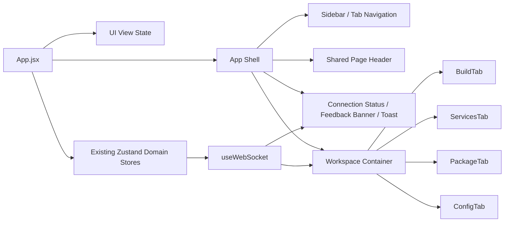
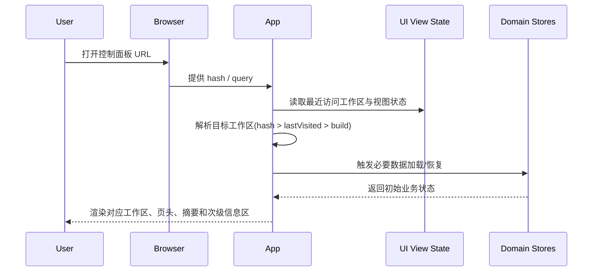
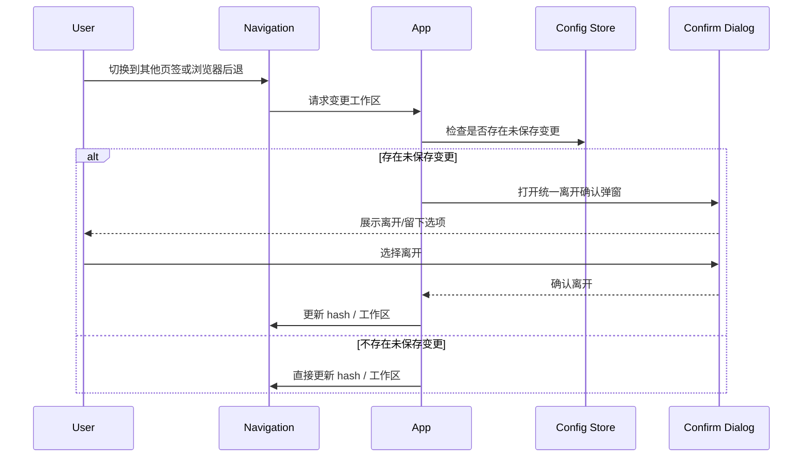
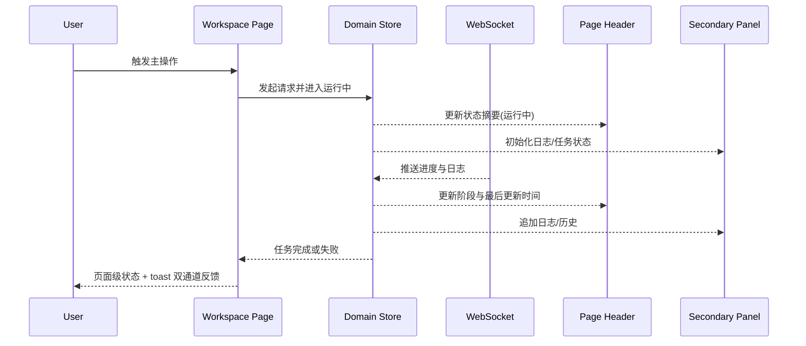

# Control Panel 前端 UI 优化 Wave 1 Design

## Spec Metadata

- 类型：Feature Spec
- Workflow：Requirements-First
- 关联需求：`.kiro/specs/frontend-ui-optimization-wave-1/requirements.md`

## 1. 设计目标

本轮设计不追求“推倒重做 UI”，而是通过共享壳层、统一层级、轻量路由同步和视觉收敛，让控制面板更适合高频运维工作流。

设计目标：

- **定位清晰**：用户始终知道当前在哪个页面、当前系统状态如何、下一步主要操作是什么。
- **结构稳定**：四个工作区使用相近的页面骨架和操作逻辑，减少切换成本。
- **视觉收敛**：保留品牌感，但减少装饰性噪音，让状态、风险和主动作更突出。
- **窄屏可用**：小屏也能完成核心操作，不因固定高度和隐藏溢出造成内容不可达。
- **增量演进**：尽量基于现有组件和 Zustand store 演进，不破坏后端契约。

## 2. 现状诊断

基于现有代码，Wave 1 主要针对以下前端问题：

1. `frontend/src/App.jsx` 使用内存态 `activeTab` 控制页面切换，刷新后丢失当前页签，且缺少轻量 URL 定位能力。
2. `frontend/src/styles/index.css` 和 `frontend/src/styles/App.css` 将背景、阴影、渐变、动画等大量写死在全局样式中，页面之间缺少统一 token。
3. `frontend/src/components/Sidebar.jsx` 与各页签的标题/状态/操作布局各自为政，难以形成统一信息架构。
4. 多处视觉反馈以 emoji、悬浮变换、脉冲动画为主，适合展示，但不完全适合长时间运维场景。
5. `body { overflow: hidden; }` 与部分固定高度容器组合后，会加大窄屏或内容变长时的滚动可达性问题。
6. 页面级反馈同时分散在 toast、局部 badge、日志区和历史区，用户需要在多个区域之间自行拼接状态。
7. 无障碍能力仍偏基础：图标按钮可访问名称、导航语义、减少动态效果、焦点样式等未形成统一标准。

## 3. 设计原则

### 3.1 先统一骨架，再优化细节

优先解决“用户在哪里、此页做什么、状态如何、主操作是什么”，再处理更细节的视觉 polish。

### 3.2 主操作优先于装饰效果

对于运维控制台，信息密度和可判断性优先于炫技式动画。动效只在帮助用户理解状态变化时使用。

### 3.3 轻量路由优先于完整路由框架

当前项目仍是单页标签页式结构。Wave 1 只需让工作区能够被 URL 表达、刷新恢复和分享，不强制引入完整页面路由体系。

### 3.4 实时状态要“页面可见”

运行中、失败、连接状态、最后更新时间，应该在页面骨架层可见，而不是只沉在日志或 toast 里。

## 4. 目标界面模型

每个工作区遵循统一页面模型：

1. **Page Header**：标题、简述、状态摘要、主操作/次操作。
2. **Primary Workspace**：本页核心任务区，例如构建模块列表、服务控制卡片、打包表单、配置编辑表单。
3. **Secondary Context**：日志、历史、诊断、运行状态等辅助区域。
4. **Feedback Layer**：连接状态、错误提示、操作结果、运行中提示。

### 4.1 架构图

### 4.2 页面模板

- **桌面端**：`Page Header` 在顶部，主工作区和次级信息区组成 `main + aside` 或 `main + bottom panel` 的双层布局。
- **平板端**：状态摘要与主操作区收缩为上下堆叠，保留清晰层级。
- **移动端**：导航横向滚动，页头压缩为一列，日志和次级区域默认折叠或延后出现，但关键状态与主操作保留在首屏。

## 5. 关键设计决策

### 5.1 使用轻量 URL 状态同步，而非完整路由重构

**方案**：使用 `location.hash` 或受控 query 参数表达当前工作区，例如 `/#build`、`/#services`。

**原因**：

- 当前控制面板仍是单页四工作区模型，不存在复杂嵌套路由刚需。
- 只需解决刷新恢复、深链定位和浏览器前进后退的一致性。
- 避免为本轮 UI 优化引入额外依赖和重构面。

**行为规则**：

- 初始打开时，解析 URL 工作区；若不存在则回落到最近访问页，再回落到 `build`。
- 切换页签时更新 URL。
- 离开 `config` 时，沿用现有未保存变更保护，但把触发入口从“仅内存切换”扩展到 URL 切换和浏览器导航。

### 5.2 新增共享页面骨架组件，而不是让每个页签自定义头部

建议抽取以下共享层：

- `PageHeader`：标题、说明、状态摘要、主操作和次操作。
- `StatusSummary`：显示关键数量和状态 pill，如“运行中任务数”“健康服务数”“未保存变更数”。
- `FeedbackBanner`：页面级错误、警告、运行中提示。
- `SecondaryPanel`：承载日志、历史、诊断等次级信息容器。

这样可以在不重写四个页签业务逻辑的前提下，统一布局语言。

### 5.3 引入视觉 Token 层，收敛样式离散度

建议新增或抽离 `frontend/src/styles/tokens.css`，由 `frontend/src/styles/index.css` 引入。

Token 分层：

- **颜色**：背景、表面、边框、文字、弱文字、品牌强调、成功、警告、危险、信息。
- **间距**：`xs/sm/md/lg/xl`。
- **圆角**：控件、卡片、弹窗。
- **阴影**：常规卡片、浮层、焦点轮廓。
- **动效**：进入、悬停、反馈、减少动态效果模式。

约束：

- 通用卡片、按钮、输入框、标签不再各自维护“自定义渐变 + 自定义阴影 + 自定义 hover 形变”。
- 品牌渐变仅保留在应用头部、当前导航态或少量品牌强调区域，不进入所有可交互控件。
- emoji 从“主操作视觉依赖”降级为“可选辅助装饰”，避免成为状态识别的唯一手段。

### 5.4 页面级信息架构统一

#### Build 页

- 页头展示：模块数量、当前运行构建数、主说明。
- 主工作区：模块列表与触发构建操作。
- 次级区：构建进度、构建历史、构建日志，位置和优先级更稳定。
- 优化目标：用户不必先看日志，先看“能不能构建、是否正在构建、构建到哪一步”。

#### Services 页

- 页头展示：总服务数、健康服务数、异常服务数、连接状态摘要。
- 主工作区：服务控制卡片和批量操作。
- 次级区：服务日志与系统级确认操作说明。
- 优化目标：让“服务状态”先于“日志细节”被看见。

#### Package 页

- 页头展示：运行态、上次参数摘要、当前选中服务数。
- 主工作区：打包参数表单和开始打包主操作。
- 次级区：任务状态、日志、最近使用值说明。
- 优化目标：让参数确认和运行状态形成闭环，而不是分散在多个视觉块中。

#### Config 页

- 页头展示：未保存字段数、校验结果、应用状态。
- 主工作区：可编辑配置表单。
- 次级区：运行时摘要、诊断结果、保存/应用状态条。
- 优化目标：强化“编辑 -> 校验 -> 保存 -> 应用”的因果链路。

### 5.5 响应式策略从“仅改方向”升级为“保关键任务可达”

当前移动端主要依赖 `flex-direction` 调整。Wave 1 要求提升为“任务可达式响应式”：

- 宽屏：优先双栏或三段式，提高对比与可扫读性。
- 中屏：次级信息区适当下移，但保留标题、摘要和主操作在首屏。
- 窄屏：页面允许纵向滚动，日志区折叠或延后，导航横向滚动。
- 所有断点均避免关键按钮出现在被裁切区域或必须横向滚动才能点到。

### 5.6 无障碍与动效收敛

基础能力包括：

- 导航区提供明确语义，例如 `nav` + 当前项状态标识。
- 图标按钮必须有 `aria-label` 或文字说明。
- 自定义弹窗在打开后聚焦到主操作或标题，在关闭后返回来源控件。
- 为 `prefers-reduced-motion` 提供 CSS 降级。
- 焦点样式不依赖浏览器默认，提供统一 `focus-visible` 轮廓。

### 5.7 页面级反馈模型

反馈拆为三层：

1. **全局连接反馈**：连接状态、重连提示。
2. **页面级运行反馈**：本页是否有任务在运行、是否失败、最后更新时间。
3. **瞬时操作反馈**：toast，用于“已触发”“已保存”“请求失败”等短反馈。

这要求页面不要把“运行态”只放在 toast 里，而要在页头或固定区域持续可见。

## 6. 状态模型设计

Wave 1 推荐把“业务状态”和“UI 视图状态”分层：

- **业务状态**：继续由现有 `useServiceStore`、`useBuildStore`、`usePackageStore`、`useConfigStore` 提供。
- **UI 视图状态**：新增轻量视图状态层，负责：
  - 当前工作区
  - 最近访问工作区
  - 各页面日志面板折叠状态
  - 各页面搜索词、筛选项、局部展示偏好（仅限非破坏性状态）

建议实现方式：

- 可放入 `frontend/src/store/useAppStore.js` 的独立 slice；
- 或新增 `frontend/src/store/useUiStore.js`，仅负责视图状态。

持久化建议：

- 使用 `localStorage` 保存工作区和安全的 UI 偏好。
- 不保存未提交的敏感输入，也不保存可能与服务端运行态冲突的“提交中”标志。

## 7. 关键时序

### 7.1 首次进入与页签恢复

### 7.2 离开配置页的未保存保护

### 7.3 长时任务的页面级反馈

## 8. 组件与文件落点建议

推荐新增或演进的文件：

- `frontend/src/components/PageHeader.jsx`
- `frontend/src/components/PageHeader.css`
- `frontend/src/components/StatusSummary.jsx`
- `frontend/src/components/StatusSummary.css`
- `frontend/src/components/FeedbackBanner.jsx`
- `frontend/src/components/FeedbackBanner.css`
- `frontend/src/store/useUiStore.js` 或 `frontend/src/store/useAppStore.js` 中的 UI slice
- `frontend/src/styles/tokens.css`

推荐重点改造但保留职责边界的文件：

- `frontend/src/App.jsx`
- `frontend/src/components/Sidebar.jsx`
- `frontend/src/components/BuildTab.jsx`
- `frontend/src/components/ServicesTab.jsx`
- `frontend/src/components/PackageTab.jsx`
- `frontend/src/components/ConfigTab.jsx`
- `frontend/src/styles/index.css`
- `frontend/src/styles/App.css`

## 9. 正确性属性

Wave 1 实施后，应保持以下不变量：

1. **Route-State Parity**：任一受支持工作区在任意时刻都应有唯一的 URL 表达，且 URL 与当前显示页面一致。
2. **Unsaved-Guard Safety**：只有离开存在未保存变更的 `config` 页面时才触发离开保护；普通页面切换与刷新数据不应被误拦截。
3. **Realtime Consistency**：页面头部的运行状态摘要与次级日志/状态面板必须来自同一业务状态源，不能出现互相矛盾的状态表达。
4. **Responsive Reachability**：在定义断点下，主操作、关键状态摘要和当前导航项必须始终可见或可在一次自然滚动内触达。
5. **Token Discipline**：共享基础控件不得重新引入无约束的硬编码品牌色、阴影和 hover 变换；例外情况必须是少数显式强调场景。

## 10. 风险与折中

### 10.1 不引入 `react-router`

优点：改动小、风险低、与现有结构兼容。

代价：后续若演进到更复杂子页面结构，仍可能需要完整路由方案。

### 10.2 不在 Wave 1 推多主题

优点：避免 token 体系过度膨胀，先解决信息层级和可达性。

代价：视觉主题灵活性先不扩展。

### 10.3 保留现有页面职责，不做业务重构

优点：聚焦 UI/UX 根因，避免把问题扩散到 API 或状态模型重写。

代价：部分组件体量仍较大，后续可能需要在 Wave 2 再做组件颗粒度细化。

## 11. 验证策略

实现阶段优先采用窄范围人工验证与构建验证：

- 刷新后页签是否保持
- 浏览器前进/后退是否与工作区一致
- `config` 页的未保存离开保护是否只在正确场景触发
- 四个页签是否都具备统一页头、状态摘要和主操作区
- 桌面 / 平板 / 移动三档下关键操作是否可达
- 键盘是否可完成导航、主操作、弹窗确认和日志搜索聚焦
- WebSocket 运行态、日志和页头摘要是否一致

