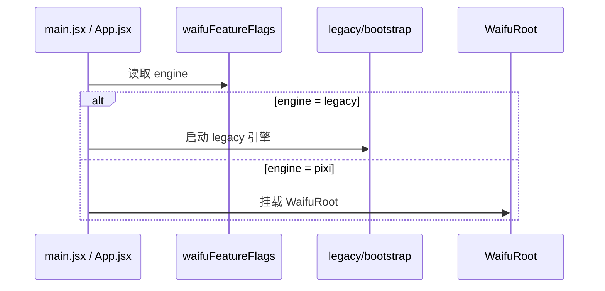
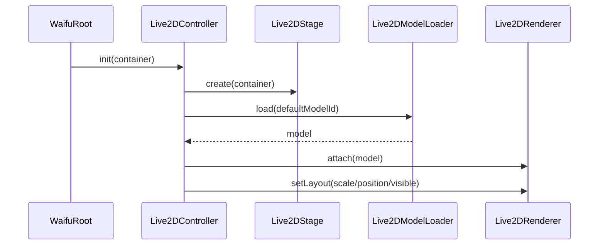
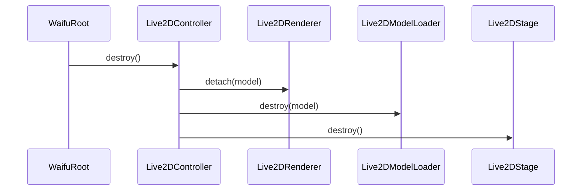

# 设计文档

## 概述

本设计将当前看板娘迁移工作收敛为一个**最小可实施基础层**。目标不是替换全部 legacy 功能，而是在现有 React + Vite 工程中建立一个可运行、可销毁、可回退的 Pixi + Live2D 基础框架，用于验证 `pixi-live2d-display` 在当前项目中的实际可行性。

第一阶段只解决以下问题：

- 新旧引擎如何安全切换
- Pixi canvas 如何在 React 中稳定挂载和销毁
- 单个目标模型如何通过官方推荐入口完成加载
- runtime / 资源路径 / StrictMode 是否真实可行
- 后续扩展应基于哪个最小控制入口继续演进

本设计不覆盖聊天、情绪、嘴型、交互增强、智能出现、勿扰、WebSocket 桥接等高阶功能。

---

## 核心设计目标

1. **先跑通基础层**
   确保单模型能在 React StrictMode 下稳定加载、显示、销毁。

2. **保证可回退**
   在新引擎未成熟前，保留 legacy 作为显式回退路径。

3. **收敛启动入口**
   把引擎选择和挂载时机统一到 React/Vite 启动路径中。

4. **验证资源装配**
   提前识别模型路径、贴图访问、Cubism runtime 和构建链路中的实际阻塞点。

5. **为后续迁移留稳定扩展点**
   用 `Live2DController`、模型配置和基础目录结构承接后续能力扩展。

---

## 非目标（Out of Scope）

以下内容明确不属于本 spec：

- 聊天面板与 `/api/chat/message` 适配
- 嘴型同步（text/audio lip-sync）
- 情绪系统、motion 编排、expression 管理
- 点击反馈、命中测试、拖拽、gaze/focus 增强
- 智能出现、提示气泡、勿扰模式
- WebSocket 事件桥接
- 多模型切换与模型能力矩阵
- 大规模 legacy 清理

这些能力应在基础层验证通过后，由后续 spec 继续承接。

---

## 当前现状与问题归纳

当前仓库中的事实基础：

- `frontend/index.html` 仍直接注入 legacy Live2D 脚本并执行初始化。
- legacy 实现依赖 `window.Image` patch 处理资源跨域。
- legacy 通过 DOM 劫持、`MutationObserver` 和 prototype patch 承载大量业务逻辑。
- React 主应用入口位于 `frontend/src/main.jsx`，且默认启用了 StrictMode。
- 主应用 UI 已运行在 React 18 + Zustand 体系中，适合作为新引擎接入点。
- 当前已有目标模型资源位于 `frontend/public/live2d/fuxuan/符玄.model3.json`。

因此，第一阶段应优先解决“能否稳定接入”的问题，而不是先追求功能等价。

---

## 技术选型

| 层级 | 技术 | 说明 |
|------|------|------|
| UI 层 | React 18 | 承载 `WaifuRoot` 与画布容器 |
| 渲染层 | PixiJS | 管理 canvas、stage、resize、销毁 |
| Live2D 接入层 | pixi-live2d-display | 作为统一模型加载入口 |
| 状态/配置层 | 简单配置模块 | 第一阶段只需要 feature flag 和模型配置 |
| 构建环境 | Vite | 当前前端工程默认构建链路 |
| 验证方式 | 本地 PoC + 手动验收 | 第一阶段先以跑通为主 |

---

## 分层边界

### 1. 启动层

负责读取 feature flag，并决定当前使用 `legacy` 还是 `pixi` 引擎。

### 2. UI 容器层

负责在 React 中渲染 `WaifuRoot` 和 `Live2DCanvas`，不承担底层引擎逻辑。

### 3. 引擎基础层

负责 Pixi Application、stage、模型 attach/detach、resize 和 destroy。

### 4. 控制器层

负责向 UI 提供最小业务友好的 API，例如：`init`、`destroy`、`show`、`hide`、`reloadModel`。

### 5. 配置层

负责模型路径、默认缩放、位置、目标模型 ID 和 feature flag。

### 禁止跨层事项

- UI 组件不得直接操作 `Live2DModel` 实例。
- UI 组件不得直接 new Pixi Application。
- `frontend/index.html` 不得承担 pixi 引擎的初始化逻辑。
- 第一阶段不得通过 patch 第三方原型来补齐基础能力。

---

## 推荐目录结构

```text
frontend/src/live2d/
├── engine/
│   ├── Live2DStage.js
│   ├── Live2DModelLoader.js
│   └── Live2DRenderer.js
├── controller/
│   └── Live2DController.js
├── ui/
│   ├── WaifuRoot.jsx
│   └── Live2DCanvas.jsx
├── config/
│   ├── waifuFeatureFlags.js
│   └── waifuModels.js
└── legacy/
    └── bootstrap.js
```

说明：

- 只建立当前最小范围需要的目录。
- `store/`、`services/`、`features/` 暂不引入。
- 若 legacy 需要保留，应先把其启动入口抽成独立 bootstrap，再由主应用显式调用。

---

## 启动与切换策略

### 单一入口原则

引擎选择必须发生在 React/Vite 启动路径，而不是继续由 `index.html` 的多个内联脚本共同决定。

### 推荐流程



### 迁移期约束

- `legacy` 与 `pixi` 同时只允许一个引擎运行。
- `pixi` 启用时，legacy 启动逻辑不得执行。
- `legacy` 保留仅用于回退，不再继续叠加新能力。

---

## 核心组件设计

### 1. waifuFeatureFlags.js

**职责：** 提供单一引擎切换配置。

**示例：**
```js
export const WAIFU_FEATURE_FLAGS = {
  engine: 'legacy' // 'legacy' | 'pixi'
}
```

**设计要求：**
- 第一阶段只保留 `engine` 一个核心开关即可。
- 不提前引入大量未使用的功能 flag。

---

### 2. waifuModels.js

**职责：** 定义目标模型配置。

**示例：**
```js
export const WAIFU_MODELS = {
  fuxuan: {
    id: 'fuxuan',
    name: '符玄',
    path: '/live2d/fuxuan/符玄.model3.json',
    scale: 0.15,
    position: { x: 0, y: 100 }
  }
}

export const DEFAULT_WAIFU_MODEL_ID = 'fuxuan'
```

**设计要求：**
- 只配置一个目标模型即可。
- 所有模型路径必须收敛在此处。
- 不在业务代码里散落硬编码模型 URL。

---

### 3. Live2DStage

**职责：** 创建和管理 Pixi Application 及 canvas 挂载生命周期。

**接口：**
```ts
interface Live2DStage {
  create(container: HTMLElement): Promise<void>
  resize(width: number, height: number): void
  getApp(): PIXI.Application | null
  destroy(): void
}
```

**实现要点：**
- 只负责 Pixi Application 和 canvas 生命周期。
- 组件重复挂载时应保证幂等。
- destroy 必须彻底清理 canvas 和监听器。

---

### 4. Live2DModelLoader

**职责：** 封装目标模型加载。

**接口：**
```ts
interface Live2DModelLoader {
  load(modelId: string): Promise<Live2DModel>
  destroy(model: Live2DModel): void
}
```

**实现要点：**
- 使用 `Live2DModel.from(...)` 或等价官方推荐入口。
- 根据 `waifuModels.js` 解析模型路径。
- 若加载失败，返回可诊断错误，不吞掉异常上下文。
- 必须考虑 React StrictMode 或快速卸载带来的 stale promise 问题。

---

### 5. Live2DRenderer

**职责：** 将模型挂载到 stage，并应用基础布局。

**接口：**
```ts
interface Live2DRenderer {
  attach(model: Live2DModel): void
  detach(model: Live2DModel): void
  setLayout(options: {
    x?: number
    y?: number
    scale?: number
    visible?: boolean
  }): void
  setVisible(visible: boolean): void
}
```

**实现要点：**
- 只负责基础布局和显隐。
- 第一阶段不承担交互与业务状态。

---

### 6. Live2DController

**职责：** 提供最小统一门面。

**接口：**
```ts
interface Live2DController {
  init(container: HTMLElement): Promise<void>
  destroy(): void
  reloadModel(): Promise<void>
  show(): void
  hide(): void
}
```

**实现要点：**
- 内部组合 `Live2DStage`、`Live2DModelLoader`、`Live2DRenderer`。
- UI 只能调用控制器，不直接接触底层实例。
- 初始化和销毁必须幂等。

---

### 7. Live2DCanvas

**职责：** 提供纯容器节点给 Pixi canvas 挂载。

**约束：**
- 不写业务逻辑。
- 不直接操作模型。

---

### 8. WaifuRoot

**职责：** 在 React 中承接新引擎生命周期。

**职责边界：**
- 创建容器 ref。
- 在 mount 时初始化 controller。
- 在 unmount 时销毁 controller。
- 渲染位置以附加模块方式存在，不影响主工作区。

---

### 9. legacy/bootstrap.js

**职责：** 作为 legacy 回退入口。

**设计要求：**
- 将 legacy 启动过程从 `frontend/index.html` 内联脚本中抽离出来。
- 只作为回退使用，不继续新增功能。
- 若短期内不能完全抽离，可先定义过渡性边界：由 `index.html` 仅保留 legacy 启动，而 pixi 完全走 React 路径。

---

## 数据流

### 1. pixi 引擎初始化



### 2. 销毁流程



---

## Blockers（进入后续阶段前必须完成）

1. **依赖兼容确认**
   - 明确 PixiJS 版本与 `pixi-live2d-display` 的可用组合。
   - 明确是否需要额外交互插件或运行时依赖。

2. **目标模型 PoC 跑通**
   - `fuxuan` 模型能在当前 React 页面中完成加载、显示、销毁。

3. **资源路径验证完成**
   - 模型 JSON、贴图和相关资源在本地开发环境中可访问。
   - 路径解析不依赖 `window.Image` patch。

4. **StrictMode 稳定性验证完成**
   - 重复挂载/卸载后不会残留多实例、重复 canvas 或异常监听器。

只有以上 blocker 全部通过，才应进入更大范围的功能迁移。

---

## 涉及文件清单

| 文件 | 修改类型 | 说明 |
|------|---------|------|
| `frontend/src/main.jsx` | 评估接入点 | 保持 StrictMode 不变 |
| `frontend/src/App.jsx` | 修改 | 挂载 `WaifuRoot` 或接入引擎选择逻辑 |
| `frontend/src/live2d/config/waifuFeatureFlags.js` | 新建 | 引擎切换配置 |
| `frontend/src/live2d/config/waifuModels.js` | 新建 | 目标模型配置 |
| `frontend/src/live2d/ui/WaifuRoot.jsx` | 新建 | 新引擎根组件 |
| `frontend/src/live2d/ui/Live2DCanvas.jsx` | 新建 | 画布容器 |
| `frontend/src/live2d/engine/Live2DStage.js` | 新建 | Pixi 底座 |
| `frontend/src/live2d/engine/Live2DModelLoader.js` | 新建 | 模型加载器 |
| `frontend/src/live2d/engine/Live2DRenderer.js` | 新建 | 模型挂载与布局 |
| `frontend/src/live2d/controller/Live2DController.js` | 新建 | 最小控制门面 |
| `frontend/src/live2d/legacy/bootstrap.js` | 新建/抽离 | legacy 回退入口 |
| `frontend/index.html` | 后续修改 | 最终收敛 legacy 启动边界 |

---

## 正确性属性

### Property 1: 单引擎唯一性

*For any* 应用启动过程，同一时刻只允许存在一个看板娘引擎实例，且 `legacy` 与 `pixi` 不得并行初始化。

**Validates: Requirements 1.1-1.5**

---

### Property 2: 基础层资源清理完整性

*For any* `WaifuRoot` 卸载过程，Pixi Application、canvas、模型实例和事件监听器都必须被完整释放。

**Validates: Requirements 3.4, 3.5, 5.4**

---

### Property 3: 失败隔离

*For any* pixi 引擎初始化失败，错误影响范围必须限制在看板娘模块内部，不得破坏主应用启动和现有页面交互。

**Validates: Requirements 6.1-6.4**

---

## 错误处理

### 1. 模型加载失败

**场景：** 路径错误、资源不可访问、格式不兼容

**处理策略：**
- 输出可诊断错误日志
- 不挂载半初始化模型
- 不影响主应用
- 允许回退到 legacy

---

### 2. Pixi 初始化失败

**场景：** 依赖版本不兼容、浏览器环境不满足要求

**处理策略：**
- 捕获初始化异常
- 阻止继续创建模型实例
- 记录错误并将 pixi 视为当前环境不可用

---

### 3. StrictMode 重复挂载导致竞态

**场景：** 第一次挂载发起异步加载，组件很快卸载并重新挂载

**处理策略：**
- 使用 controller 内部状态或 token 丢弃过期加载结果
- 对过期实例立即销毁
- 不保留悬挂 canvas 或模型引用

---

## 测试与验收策略

第一阶段不要求完整自动化测试体系，但必须完成以下最小验收：

1. **本地功能验收**
   - `engine = pixi` 时页面可正常打开
   - 目标模型可显示
   - 页面刷新后仍可正常加载

2. **StrictMode 验收**
   - 首次进入页面无重复 canvas
   - 反复热更新/重载后无明显残留实例

3. **回退验收**
   - `engine = legacy` 时仍可回到旧实现
   - pixi 失败不影响回退路径

4. **资源链路验收**
   - 模型 JSON、贴图和 runtime 来源被明确记录
   - 新引擎不依赖 `window.Image` patch

---

## 风险与缓解

### 风险 1：Pixi 与库版本不兼容
**缓解措施：** 在编码前先完成兼容矩阵和最小 PoC。

### 风险 2：模型资源路径在 Vite 下解析异常
**缓解措施：** 优先使用 `public/live2d/...` 的同源静态资源路径，并记录本地与生产解析结果。

### 风险 3：StrictMode 导致双挂载问题
**缓解措施：** 控制器与 stage 保持幂等，显式清理 stale 实例。

### 风险 4：范围失控
**缓解措施：** 明确把聊天、交互增强、WebSocket 等排除在本 spec 之外。
