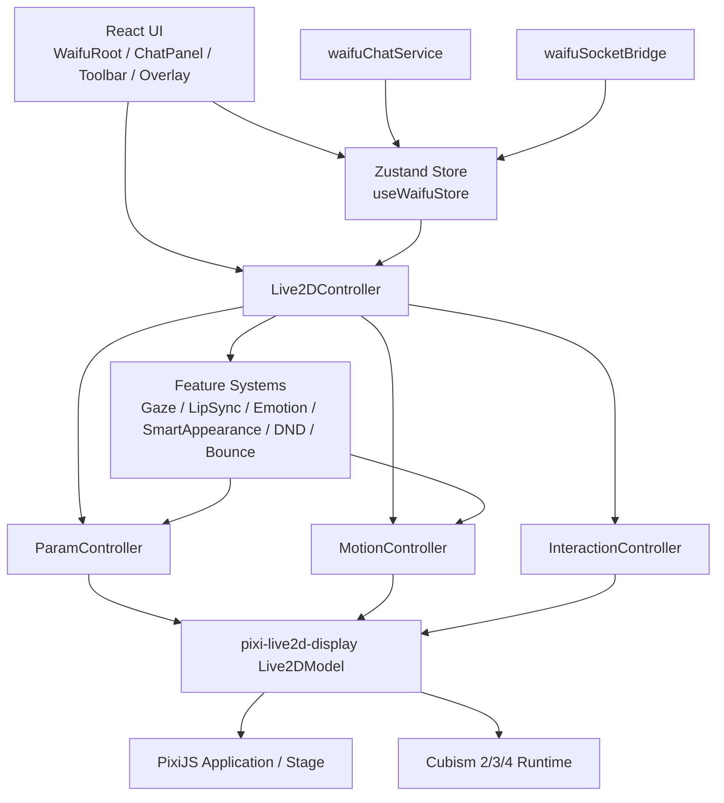
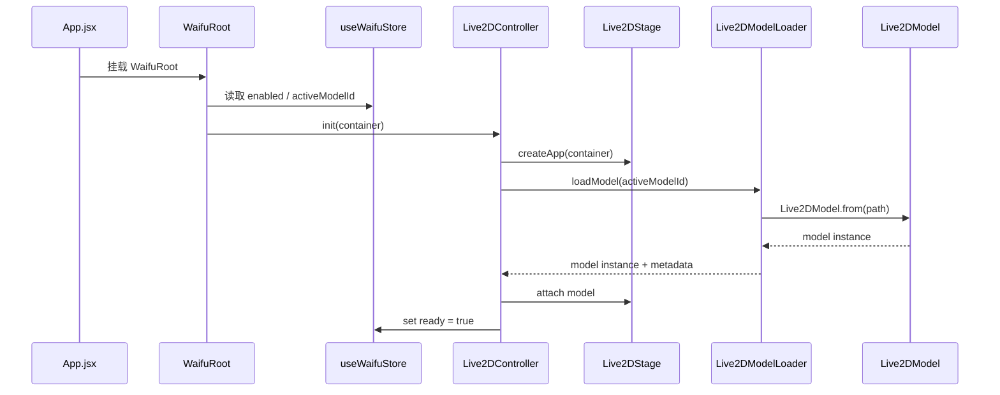
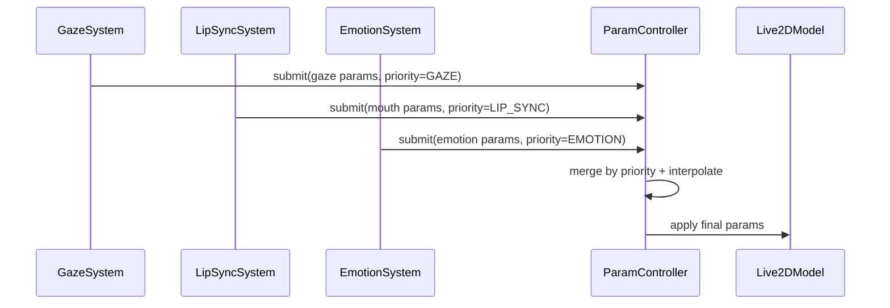
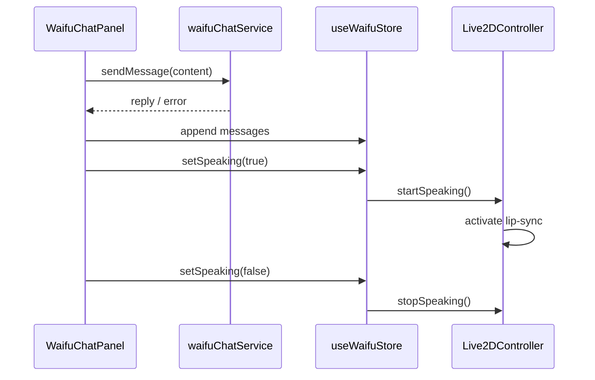
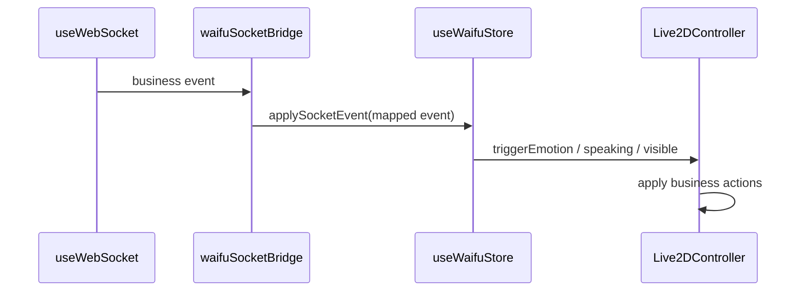

# 设计文档

## 概述

本设计用于将当前 control panel 项目中的看板娘系统，从基于 `live2d-widgets` 的内联脚本实现迁移为基于 `pixi-live2d-display` 的 React + Zustand + Pixi 模块化实现。

设计目标不是重写 Live2D 底层运行时，而是建立一个稳定的业务编排层，在 `pixi-live2d-display` 已有的统一模型抽象能力之上，实现适合当前项目的模型管理、参数调度、聊天 UI、交互控制、状态同步和业务事件桥接。

该方案重点解决以下问题：

- 摆脱 `live2d-widgets` 每帧重置参数带来的深度定制限制
- 移除对全局 hack 的依赖
- 把 Live2D 正式纳入现有 React 工程
- 保留当前视线、嘴型、情绪、聊天、拖拽、智能出现、勿扰和 WebSocket 联动能力
- 让迁移方案建立在 `pixi-live2d-display` 实际能力边界之上

---

## 设计原则

1. **库能力优先**
   优先复用 `pixi-live2d-display` 已有的加载、渲染、动作、表情、命中检测与交互能力，不在业务层重复实现底层运行时逻辑。

2. **业务编排与引擎解耦**
   React、Zustand、聊天服务、WebSocket 桥接等业务逻辑不得直接耦合第三方库内部实现，统一经由 `Live2DController` 进行调用。

3. **不修改第三方库源码**
   迁移过程中不得 patch `pixi-live2d-display` 源码，不得依赖内部未公开 API 作为长期方案。

4. **模型兼容优先于单模型特化**
   所有参数控制、动作调度、能力开关均应支持模型级配置覆盖，而非只针对单一模型硬编码。

5. **先验证边界，再扩大迁移面**
   在完成底座、参数、交互等关键节点前，必须优先验证库能力是否满足业务要求。

6. **PoC 先于重构**
   兼容矩阵、最小 React PoC、motion / expression / overlay 时序和交互边界验证必须先通过，再进入大面积实现。

---

## 核心设计目标

1. **建立稳定渲染底座**  
   在 React 环境下稳定加载、显示、切换和销毁 Live2D 模型。

2. **建立业务级控制中枢**  
   通过 `Live2DController`、`ParamController` 和特性系统统一协调模型行为。

3. **剥离遗留 DOM 劫持逻辑**  
   将聊天、提示、工具栏等 UI 功能迁移到 React 组件体系中。

4. **构建可扩展状态与桥接机制**  
   用 Zustand 统一状态，用服务桥接层连接聊天接口和 WebSocket 事件。

5. **在库能力边界内实现功能等价迁移**  
   先验证 `pixi-live2d-display` 的可行性，再逐步替换 legacy 实现。

---

## 技术选型

| 层级 | 技术 | 说明 |
|------|------|------|
| UI 层 | React 18 | 承载聊天、工具栏、状态浮层 |
| 状态层 | Zustand | 管理可见性、聊天、说话、情绪、模型切换等运行时状态 |
| 渲染层 | PixiJS | 管理 canvas、stage、ticker、显示对象 |
| Live2D 引擎层 | pixi-live2d-display | 提供统一模型加载、渲染、motion/expression、hit test 等能力 |
| 模型运行时 | Live2D Cubism 2/3/4 | 模型资源与底层官方 SDK 约束 |
| 服务层 | fetch / useWebSocket | 聊天 API 与业务事件桥接 |
| 测试 | Vitest / React Testing Library / Playwright | 单元、组件、集成与 E2E 测试 |

---

## 分层边界

### 引擎层（第三方库）

由 `pixi-live2d-display` 提供，负责：

- 模型资源加载
- 模型实例创建
- Pixi 显示对象集成
- 基础 motion / expression 能力
- hit test 与基础交互支持
- 模型 update/render 生命周期接入

### 业务编排层（本项目）

由 `frontend/src/live2d/` 下模块提供，负责：

- React 挂载与卸载时机
- Zustand 状态同步
- 参数优先级合并
- 业务事件到动作/表情的翻译
- 聊天与说话状态联动
- 勿扰、智能出现、提示等产品逻辑

### 禁止跨层事项

- UI 组件不得直接访问底层 Cubism runtime
- Service 层不得直接操作 Pixi 显示对象
- Store 不得持有第三方库实例
- 不得通过 patch 第三方原型来实现业务功能

---

### 库真实边界说明

基于当前对 `pixi-live2d-display` 源码与文档的调研，本迁移必须明确以下边界：

- `Live2DModel.from(...)` 是模型加载统一主入口。
- 库原生稳定暴露的高层能力主要包括模型加载、motion、expression、focus、hit test / tap 相关能力。
- `tap()` 的语义是“执行命中检测并发出 hit 事件”，不是完整的点击反馈系统；bounce、提示、情绪或 tap motion 仍需业务层编排。
- 文档层面只把 focus 与 tap 作为基础交互能力；拖拽不应被视为库原生能力，需由 `InteractionController` 基于 Pixi pointer 事件自行实现。
- Cubism4 内部更新链路包含 motion、expression、focus、physics/pose 等阶段，而 lip-sync 在库内并无稳定公开 API 保证，因此嘴型同步必须由 `LipSyncSystem + ParamController` 负责主实现。
- 销毁流程虽可帮助中止部分底层加载请求，但 React 场景下仍需业务层处理 StrictMode 双挂载、stale promise 和模型切换竞态。

---

## 前置闸门（Blockers）

以下事项在进入大规模迁移实现前必须完成，否则只允许停留在验证和收口阶段：

1. **兼容矩阵确认**
   - 明确当前项目将采用的 PixiJS 主版本与 `pixi-live2d-display` 实际兼容组合。
   - 明确是否需要额外注册 interaction 插件或选择完整 Pixi 构建。

2. **最小 React PoC 跑通**
   - 至少一个目标模型可在 React + Vite 页面中通过 `Live2DModel.from(...)` 成功加载、显示、销毁。
   - 验证 StrictMode 下不会残留多实例、重复 canvas 或未释放监听器。

3. **关键时序验证完成**
   - 明确 motion / expression / ParamController overlay 的实际共存时序。
   - 明确业务层参数写入应挂在何处，才能避免被 motion/expression 覆盖或产生抖动。

4. **交互边界验证完成**
   - 验证 focus / hit test 可直接复用。
   - 验证 drag 需要业务层自己实现且可与 store.position 正确同步。

---

## 架构设计



---

## 目录结构

```text
frontend/src/live2d/
├── engine/
│   ├── Live2DStage.js
│   ├── Live2DModelLoader.js
│   └── Live2DRenderer.js
├── controller/
│   ├── Live2DController.js
│   ├── ParamController.js
│   ├── MotionController.js
│   └── InteractionController.js
├── features/
│   ├── gaze/GazeSystem.js
│   ├── lipSync/LipSyncSystem.js
│   ├── emotion/EmotionSystem.js
│   ├── appearance/SmartAppearanceSystem.js
│   ├── dnd/DoNotDisturbSystem.js
│   └── physics/BounceSystem.js
├── ui/
│   ├── WaifuRoot.jsx
│   ├── Live2DCanvas.jsx
│   ├── WaifuOverlay.jsx
│   ├── WaifuChatPanel.jsx
│   └── WaifuToolbar.jsx
├── store/
│   └── useWaifuStore.js
├── services/
│   ├── waifuChatService.js
│   └── waifuSocketBridge.js
├── legacy/
│   └── bootstrap.js
├── config/
│   ├── waifuModels.js
│   └── waifuFeatureFlags.js
└── utils/
    ├── paramMap.js
    ├── lerp.js
    ├── clamp.js
    └── rafLoop.js
```

---

## 启动与引擎切换策略

### 迁移期约束

- `frontend/index.html` 在最终状态下不得直接执行看板娘启动脚本。
- legacy 引擎启动逻辑应抽离为模块化 bootstrap，由 React/Vite 入口按 feature flag 显式决定是否加载。
- 引擎选择应发生在单一入口（如 `main.jsx` 或等价启动层），同一时刻只允许存在一个引擎实例。
- `engine = legacy` 时只执行 legacy bootstrap。
- `engine = pixi` 时只挂载 `WaifuRoot`，不得执行 legacy bootstrap。

### 推荐启动流程

1. 应用启动读取 `waifuFeatureFlags.js`
2. 判断 `engine`
3. `legacy` -> 动态加载 legacy bootstrap
4. `pixi` -> 渲染 `WaifuRoot`
5. 任一分支失败均不得影响主应用启动

---

## 数据流

### 1. 初始化数据流



### 2. 参数控制数据流



### 3. 聊天交互数据流



### 4. WebSocket 事件桥接数据流



---

## 核心组件和接口

### 1. Live2DStage

**职责：** 创建和管理 Pixi Application 以及 canvas 挂载生命周期。

**接口：**
```ts
interface Live2DStage {
  create(container: HTMLElement): Promise<void>
  resize(width: number, height: number): void
  getApp(): PIXI.Application | null
  destroy(): void
}
```

**实现要点：**
- 创建 Pixi Application
- 管理 canvas 挂载
- 处理 resize
- 处理 destroy 清理
- 保证 StrictMode 下幂等

**验证需求：** 2.1-2.5, 16.1-16.5

---

### 2. Live2DModelLoader

**职责：** 封装基于 `pixi-live2d-display` 的模型加载、切换和异常处理。

**实现策略：**
- 优先通过 `Live2DModel.from(modelPath, options)` 加载模型
- 加载完成后返回统一模型实例
- 支持模型切换时先销毁旧实例再挂载新实例
- 支持按模型配置设置 scale、position、anchor、offset
- 支持预加载常用模型资源
- 对 React StrictMode、快速切模和异步加载竞争增加 stale request 防护

**接口：**
```ts
interface Live2DModelLoader {
  load(modelId: string): Promise<{
    model: Live2DModel
    meta: {
      modelId: string
      capabilities: Record<string, boolean>
      parameters?: string[]
      motions?: string[]
      expressions?: string[]
    }
  }>
  preload(modelId: string): Promise<void>
  destroy(model: Live2DModel): void
}
```

**失败处理：**
- 加载失败记录日志
- 回退默认模型或显示禁用态
- 不传播未处理异常到 UI 层
- 若异步结果已过期（如用户已切换模型或控制器已销毁），则丢弃结果并立即清理对应实例

**验证需求：** 2.2, 4.2, 15.1, 18.2, 19.1-19.5, 20.1

---

### 3. Live2DRenderer

**职责：** 将模型挂到 stage，并设置布局、层级、可见性和基础变换。

**接口：**
```ts
interface Live2DRenderer {
  attach(model: Live2DModel): void
  detach(model: Live2DModel): void
  setLayout(options: {
    x?: number
    y?: number
    scale?: number
    visible?: boolean
  }): void
  setVisible(visible: boolean): void
}
```

**实现要点：**
- 只负责渲染挂载和基础变换
- 不承载业务状态逻辑
- 模型切换时正确移除旧实例

**验证需求：** 2.2-2.4, 13.2

---

### 4. Live2DController

**职责：** 作为业务层对 `pixi-live2d-display` 的统一门面（Facade），屏蔽第三方库调用细节。

**内部依赖：**
- Live2DStage
- Live2DModelLoader
- Live2DRenderer
- ParamController
- MotionController
- InteractionController
- GazeSystem
- LipSyncSystem
- EmotionSystem
- SmartAppearanceSystem
- DoNotDisturbSystem
- BounceSystem

**推荐 API：**
```ts
interface Live2DController {
  init(container: HTMLElement): Promise<void>
  destroy(): void

  loadModel(modelId: string): Promise<void>
  switchModel(modelId: string): Promise<void>

  show(): void
  hide(): void
  resize(width: number, height: number): void

  setEmotion(emotion: string, options?: { duration?: number }): void
  startSpeaking(meta?: { source?: 'text' | 'audio' }): void
  stopSpeaking(): void
  bounce(): void

  setDnd(enabled: boolean): void
  setGazeEnabled(enabled: boolean): void
  setFocusTarget(x: number, y: number): void
  setPosition(x: number, y: number): void
}
```

**核心原则：**
- 对外暴露业务友好 API
- 对内调用 `Live2DModel` 实例及各业务子控制器
- 不向 UI 暴露第三方实例
- 初始化和销毁流程必须幂等

**验证需求：** 4.1-4.5, 16.1-16.5, 18.5

---

### 5. ParamController

**职责：** 统一管理参数写入，合并 gaze / emotion / lip-sync / bounce / drag 等参数意图。

**优先级定义：**
```ts
const PRIORITY = {
  IDLE: 1,
  GAZE: 2,
  LIP_SYNC: 3,
  EMOTION: 4,
  DRAG: 5
}
```

**接口：**
```ts
interface ParamController {
  submit(source: string, params: Record<string, number>, priority: number): void
  release(source: string): void
  tick(delta: number): void
  clear(): void
}
```

**实现要点：**
- 合并多个参数意图
- 按优先级选取最终值
- 支持插值和平滑过渡
- 通过 `paramMap.js` 处理不同模型参数命名差异
- 在 motion / expression 共存场景下保持稳定结果

**冲突决策表：**

| 场景 | 规则 |
|------|------|
| 不同来源写不同参数 | 按参数键独立合并 |
| 不同来源写同一参数 | 取该参数最高优先级来源 |
| 同优先级写同一参数 | latest write wins |
| motion / expression 与 overlay 共存 | 先执行 motion / expression，再应用 overlay |
| source release | 基于剩余来源重新计算最终值 |
| 参数不存在 | 跳过并记录 warning，不抛异常 |

**插值策略：**
- 插值发生在“最终应用值”层，而不是每个来源各自插值
- 每一帧只向模型写入一次最终参数结果
- `tick(delta)` 必须保持幂等，同一输入下结果可预测

**验证需求：** 3.1-3.9, 8.1-8.5, 18.4, 19.2-19.4, 20.2

---

### 6. MotionController

**职责：** 管理基于 `pixi-live2d-display` 的 motion / expression 播放，协调与参数覆盖的关系。

**接口：**
```ts
interface MotionController {
  playMotion(group: string, index?: number, priority?: number): Promise<void>
  setExpression(expressionId: string): Promise<void>
  stopAll(): void
}
```

**实现要点：**
- 优先使用库内 motion / expression API
- idle、tap、emotion motion 统一由此控制
- 与 ParamController 协调冲突边界
- 必要时优先选择"参数 preset + 少量 motion"的混合方案

**验证需求：** 3.4, 6.2-6.4, 18.3, 20.2

---

### 7. InteractionController

**职责：** 将 Pixi pointer 事件与库提供的 hit test / 模型交互能力桥接到业务动作。

**接口：**
```ts
interface InteractionController {
  bind(model: Live2DModel): void
  unbind(): void
  enableDrag(enabled: boolean): void
}
```

**实现策略：**
- 使用 Pixi pointer 事件系统监听点击、移动、拖拽
- 优先调用 `pixi-live2d-display` 的 `hitTest()` / `tap()` / `focus()` 能力
- 将 hit 结果翻译为 bounce、emotion、提示或 tap motion 等业务动作
- 拖拽能力明确由业务层实现，不假设第三方库提供原生 drag API
- 拖拽时只更新业务允许的位移属性，不破坏模型基础布局
- 若模型缺少 hit area 或库命中结果不足，则降级为 bounds 判断，但仍通过统一业务事件流输出点击结果

**事件流：**
1. pointerdown -> hit test / tap -> 记录拖拽起点并产生命中结果
2. pointermove -> 更新 focus target 或拖拽位置
3. pointerup -> 结束拖拽并回写 store

**验证需求：** 5.1-5.6, 12.4, 13.4, 18.3, 20.3

---

### 8. GazeSystem

**职责：** 实现头部、眼球和身体轻微跟随。

**接口：**
```ts
interface GazeSystem {
  setEnabled(enabled: boolean): void
  updatePointer(x: number, y: number): void
  tick(delta: number): void
}
```

**实现要点：**
- 鼠标位置转换为 gaze 参数意图
- 通过 ParamController 提交
- 失焦或静止后执行回中缓动
- 优先复用库 focus 能力，无法满足时降级为参数驱动

**验证需求：** 5.1, 3.1-3.3, 18.3

---

### 9. LipSyncSystem

**职责：** 驱动说话期间的嘴型参数。

**接口：**
```ts
interface LipSyncSystem {
  start(source?: 'text' | 'audio'): void
  stop(): void
  tick(delta: number): void
}
```

**实现要点：**
- 以 `ParamController` 提交嘴型参数作为主实现路径，不依赖 `pixi-live2d-display` 内部或未稳定公开的 lip-sync API
- 默认支持文字节奏模拟，使聊天回复场景先可用
- 预留音量驱动扩展点，但作为可选增强，不阻塞主迁移
- 缺少标准参数时通过 `paramMap` 寻址，仍无法映射时优雅降级
- speaking 结束时及时 release 对应 source，避免嘴型残留

**验证需求：** 8.1-8.6, 3.1-3.3

---

### 10. EmotionSystem

**职责：** 管理情绪预设、持续时间和恢复逻辑。

**接口：**
```ts
interface EmotionSystem {
  trigger(emotion: string, options?: { duration?: number }): void
  clear(): void
}
```

**情绪示例：**
```ts
const EMOTION_PRESETS = {
  happy: { params: { ParamMouthForm: 1, ParamEyeSmile: 1 } },
  surprise: { params: { ParamEyeWideOpen: 1, ParamBrowLY: 0.8, ParamBrowRY: 0.8 } },
  worried: { params: { ParamBrowLY: -0.6, ParamBrowRY: -0.6 } }
}
```

**实现要点：**
- 触发时应用参数组合或播放 motion
- 优先级设为 PRIORITY.EMOTION
- 生命周期结束后自动释放

**验证需求：** 6.1-6.5

---

### 11. SmartAppearanceSystem

**职责：** 处理看板娘智能出现、隐藏与提示节流。

**实现要点：**
- 根据 idle、用户交互和业务事件决定是否显示
- 管理轻提示节流
- 尊重勿扰模式状态

**验证需求：** 9.1-9.5, 10.1-10.5

---

### 12. DoNotDisturbSystem

**职责：** 统一处理勿扰模式对各自动行为的抑制规则。

**实现要点：**
- 对提示、自动情绪、智能出现进行权限裁决
- 不影响手动聊天和手动交互

**验证需求：** 10.1-10.5

---

### 13. BounceSystem

**职责：** 提供点击反馈的轻微位移、缩放或 motion 效果。

**实现要点：**
- 点击命中后触发
- 尽量使用轻量参数/变换，不引入复杂动画系统
- 与 motionController 协调 tap reaction

**验证需求：** 5.2, 5.4

---

### 14. useWaifuStore (状态管理)

**职责：** 管理看板娘运行时状态

**状态定义：**
```javascript
{
  enabled: true,
  ready: false,
  visible: true,
  dragging: false,
  chatOpen: false,
  dnd: false,
  speaking: false,
  activeEmotion: null,
  activeModelId: 'fuxuan',
  socketLinked: false,
  position: { x: 0, y: 0 }
}
```

**Actions：**
```javascript
{
  toggleChat: () => void
  setDnd: (enabled: boolean) => void
  setVisible: (visible: boolean) => void
  setDragging: (dragging: boolean) => void
  setSpeaking: (speaking: boolean) => void
  triggerEmotion: (emotion: string) => void
  switchModel: (modelId: string) => void
  applySocketEvent: (event: object) => void
  setPosition: (x: number, y: number) => void
}
```

**验证需求：** 12.1-12.5

---

### 15. WaifuChatPanel (聊天面板)

**职责：** 提供聊天 UI 和消息管理

**组件结构：**
```jsx
<div className="waifu-chat-panel">
  <div className="chat-header">
    <span>与{modelName}聊天</span>
    <button onClick={onClose}>×</button>
  </div>
  <div className="chat-messages">
    {messages.map(msg => (
      <div className={`message ${msg.role}`}>
        {msg.content}
      </div>
    ))}
  </div>
  <div className="chat-input">
    <input value={input} onChange={...} />
    <button onClick={handleSend}>发送</button>
  </div>
</div>
```

**实现要点：**
- 使用 useState 管理消息列表
- 发送时调用 waifuChatService
- 收到回复时触发 setSpeaking(true)
- 自动滚动到最新消息
- 错误处理和 loading 状态

**验证需求：** 7.1-7.7

---

### 16. WaifuToolbar

**职责：** 提供用户手动操作入口。

**按钮建议：**
- 打开/关闭聊天
- 显示/隐藏模型
- 切换模型
- 切换勿扰模式
- 信息/设置

**验证需求：** 7.6, 10.4, 12.2, 14.5

---

### 17. WaifuOverlay

**职责：** 展示提示气泡、状态和轻量联动反馈。

**验证需求：** 9.2-9.4, 11.1-11.4

---

### 18. waifuChatService

**职责：** 封装当前 `/api/chat/message` 调用。

**接口：**
```ts
interface WaifuChatService {
  sendMessage(payload: { content: string; modelId?: string }): Promise<{
    reply: string
  }>
}
```

**聊天 API 适配契约：**
```ts
type WaifuChatInput = {
  content: string
  sessionId?: string
  modelId?: string
}

type BackendChatRequest = {
  message: string
  sessionId: string
}

type BackendChatResponse = {
  success: boolean
  data?: { reply?: string }
  error?: { message?: string }
}

type NormalizedChatResponse = {
  reply: string
}
```

**适配规则：**
- `WaifuChatPanel` 只传 `content`
- `waifuChatService` 负责将 `content` 适配为后端所需的 `message`
- `waifuChatService` 负责归一化 `{ success, data.reply } -> { reply }`
- `sessionId` 由 service 或 store 维护，不放在展示组件内部
- 服务层统一抛出可展示错误信息

**实现要点：**
- 统一错误处理
- 统一返回格式
- 不在服务层管理 UI 状态

**验证需求：** 7.2-7.9, 15.3

---

### 19. waifuSocketBridge (WebSocket 桥接)

**职责：** 将后端事件转换为看板娘动作

**事件映射：**
```javascript
const EVENT_MAPPING = {
  'build:start': { emotion: 'worried', tip: '构建开始了...' },
  'build:success': { emotion: 'happy', tip: '构建成功！' },
  'build:failed': { emotion: 'surprise', tip: '构建失败了...' },
  'service:started': { emotion: 'happy', tip: '服务启动成功' },
  'service:stopped': { emotion: 'worried', tip: '服务已停止' }
}
```

**实现要点：**
- 监听 useWebSocket 的事件
- 根据事件类型触发对应情绪和提示
- 通过 useWaifuStore 的 applySocketEvent 触发
- 不直接操作 controller

**WebSocket 接入约束：**
- `waifuSocketBridge` 只复用主应用现有 WebSocket 事件流
- 桥接层是纯翻译层，不负责创建 socket 连接
- 桥接层不直接持有 `Live2DController` 实例，只通过 store action 传递业务事件
- 若主应用未提供事件源，桥接层应安全降级为空操作

**约束接口示意：**
```ts
interface WaifuSocketBridge {
  bind(subscribe: (handler: (event: BusinessEvent) => void) => () => void): () => void
}
```

**验证需求：** 11.1-11.7

---

## 库能力验证矩阵

| 能力 | 目标 | 优先方案 | 备选方案 | 风险 |
|------|------|----------|----------|------|
| 模型加载 | React 中稳定加载与销毁 | `Live2DModel.from(...)` | 延迟初始化 + fallback | StrictMode 双执行、runtime 装配失败 |
| motion 播放 | 支持 idle / tap / emotion motion | 库内 motion API | 仅参数预设 + 少量 motion | motion 抢参数 |
| expression 切换 | 支持情绪表达 | 库内 expression API | ParamController preset | 模型资源不统一 |
| gaze/focus | 支持视线跟随 | 库 `focus()` / 参数写入混合 | 纯参数驱动 | 不同模型参数差异 |
| hit test | 支持点击区域识别 | 库 `hitTest()` / `tap()` | Pixi bounds 近似命中 | 精度差异、命中区缺失 |
| drag | 支持拖拽 | 业务层 `InteractionController` + Pixi pointer + store | 仅容器拖拽 | 锚点/坐标系复杂；非库原生能力 |
| lip-sync | 支持嘴型驱动 | `ParamController` + 文本节奏模拟 | 音量驱动 | 缺少标准参数；库无稳定公开 lip-sync API |
| 销毁清理 | 防泄漏 | controller.destroy() 统一清理 | 手工清理清单 | 遗漏监听器、过期异步结果 |

---

## 数据模型与配置

### waifuModels.js

```javascript
export const WAIFU_MODELS = {
  fuxuan: {
    name: '符玄',
    path: '/live2d-models/fuxuan/fuxuan.model3.json',
    scale: 0.15,
    position: { x: 0, y: 100 },
    capabilities: {
      gaze: true,
      lipSync: true,
      expression: true,
      motion: true,
      hitTest: true,
      drag: true
    },
    paramMap: {
      mouthOpenY: ['ParamMouthOpenY', 'PARAM_MOUTH_OPEN_Y'],
      angleX: ['ParamAngleX', 'PARAM_ANGLE_X'],
      angleY: ['ParamAngleY', 'PARAM_ANGLE_Y'],
      eyeBallX: ['ParamEyeBallX', 'PARAM_EYE_BALL_X'],
      eyeBallY: ['ParamEyeBallY', 'PARAM_EYE_BALL_Y']
    }
  }
}
```

### waifuFeatureFlags.js

```javascript
export const FEATURE_FLAGS = {
  engine: 'pixi', // 'legacy' | 'pixi'
  gaze: true,
  lipSync: true,
  emotion: true,
  smartAppearance: true,
  dnd: true,
  websocketLink: true
}
```

---

## 资源与运行时装配约束

- 模型资源路径统一定义在 `waifuModels.js` 中。
- 新引擎业务代码中不得出现散落的 CDN URL、临时路径拼接或跨域修补逻辑。
- 若 Cubism runtime 需要额外加载，其来源、版本和加载方式必须在单一位置定义。
- 新引擎不得依赖重写 `window.Image`、全局 prototype patch 或 DOM 劫持解决资源加载问题。
- PoC 阶段必须验证：
  1. 模型 JSON 可访问
  2. 贴图可访问
  3. motion / expression 资源可访问
  4. runtime 装配成功
  5. 生产环境路径与本地开发路径一致可解析

---

## 正确性属性

### Property 1: 参数优先级一致性

*For any* 同时存在多个参数请求时，最终应用的参数值必须来自优先级最高的请求，且优先级顺序严格遵循 DRAG > EMOTION > LIP_SYNC > GAZE > IDLE。

**Validates: Requirements 3.1, 3.2, 3.4**

---

### Property 2: 资源清理完整性

*For any* 组件卸载或模型切换操作，所有 Pixi 资源、事件监听器、RAF 循环必须完全清理，不得有内存泄漏。

**Validates: Requirements 2.5, 13.4, 14.3**

---

### Property 3: 状态同步一致性

*For any* 状态变化（如 speaking、emotion、visible），Zustand store、UI 组件、Controller 必须保持一致，不得出现状态不同步。

**Validates: Requirements 12.4, 7.4, 11.5**

---

### Property 4: 降级安全性

*For any* 模块初始化失败或运行时错误，系统必须优雅降级，不得影响主应用功能，且必须记录错误日志。

**Validates: Requirements 15.1-15.5**

---

### Property 5: React StrictMode 幂等性

*For any* React StrictMode 导致的双执行，系统必须保证只创建一个 Pixi 实例，且卸载后重新挂载能正确恢复。

**Validates: Requirements 16.1-16.5**

---

## 错误处理

### 1. 模型加载失败

**场景：** 网络错误、模型文件损坏、格式不支持

**处理策略：**
- 显示错误提示
- 回退到默认模型
- 记录错误日志
- 不阻塞主应用

---

### 2. 参数不存在

**场景：** 模型缺少某些参数（如 ParamMouthOpenY）

**处理策略：**
- 使用 paramMap 尝试映射
- 映射失败时跳过该参数
- 不抛出异常
- 记录警告日志

---

### 3. 聊天接口失败

**场景：** 网络错误、后端异常、超时

**处理策略：**
- 显示错误消息
- 允许重试
- 不影响其他功能
- 记录错误日志

---

### 4. WebSocket 断开

**场景：** 网络中断、后端重启

**处理策略：**
- 更新 socketLinked 状态
- 禁用 WebSocket 联动功能
- 本地功能继续运行
- 自动重连（由 useWebSocket 处理）

---

### 5. Pixi 初始化失败

**场景：** WebGL 不支持、浏览器兼容性问题

**处理策略：**
- 捕获异常
- 设置 enabled = false
- 隐藏看板娘 UI
- 记录错误日志
- 不影响主应用

---

## 测试策略

### 1. 单元测试

**测试目标：**
- ParamController 优先级合并逻辑
- lerp/clamp 等工具函数
- paramMap 映射逻辑
- EmotionSystem 预设配置

**工具：** Vitest

---

### 2. 集成测试

**测试目标：**
- Live2DController 初始化流程
- 模型加载和切换
- 聊天发送和接收
- WebSocket 事件桥接

**工具：** Vitest + Mock

---

### 3. 组件测试

**测试目标：**
- WaifuRoot 渲染
- WaifuChatPanel 交互
- WaifuToolbar 按钮功能
- 状态变化响应

**工具：** Vitest + React Testing Library

---

### 4. 端到端测试

**测试目标：**
- 完整用户流程（打开聊天、发送消息、切换模型）
- 拖拽和点击交互
- WebSocket 联动
- 性能和内存泄漏

**工具：** Playwright

---

### 5. 属性测试

**测试目标：**
- Property 1: 参数优先级一致性
- Property 2: 资源清理完整性
- Property 3: 状态同步一致性
- Property 4: 降级安全性
- Property 5: React StrictMode 幂等性

**工具：** Vitest + 自定义断言

---

## 性能优化

### 1. 懒加载
- WaifuRoot 使用 React.lazy 懒加载
- 模型资源按需加载
- 首屏不阻塞主应用

### 2. RAF 优化
- 所有动画使用 requestAnimationFrame 或 Pixi ticker
- 统一更新循环，避免多个 RAF
- 页面不可见时暂停更新

### 3. 事件节流
- mousemove 事件节流（16ms）
- resize 事件防抖（200ms）
- WebSocket 事件节流

### 4. 资源清理
- 组件卸载时清理所有监听器
- 模型切换时销毁旧实例
- 定期检查内存泄漏

### 5. 预加载
- 预加载常用模型
- 预加载情绪 motion
- 使用缓存减少重复请求

---

## 依赖项

### 新增依赖

迁移方案必须与 `pixi-live2d-display` 支持的 PixiJS 主版本保持一致。若当前项目已使用其他 PixiJS 主版本，则需先验证兼容性或选择对应兼容版本。

**建议原则：**
- `pixi-live2d-display` 版本需与项目实际选用的 PixiJS 版本匹配
- Cubism runtime 依赖按模型版本与库要求安装
- 依赖版本在实施前通过 PoC 固化，而非在规范阶段写死

**示例（需以实际兼容矩阵为准）：**
```json
{
  "pixi.js": "与 pixi-live2d-display 兼容的版本",
  "pixi-live2d-display": "经验证可用的版本",
  "live2d runtime dependencies": "按实际模型版本安装"
}
```

### 现有依赖

- React 18
- Zustand
- react-hot-toast

---

## 兼容性说明

### 浏览器支持
- Chrome 90+
- Firefox 88+
- Safari 14+
- Edge 90+

### WebGL 要求
- 需要 WebGL 1.0 支持
- 降级时禁用看板娘

### React 版本
- React 18+
- 支持 StrictMode

---

## 风险缓解

### 风险 1: 参数不统一
**缓解措施：** `paramMap.js` 提供映射，`waifuModels.js` 支持模型级覆盖

### 风险 2: motion 冲突
**缓解措施：** ParamController 统一优先级，情绪优先使用参数 preset

### 风险 3: 视觉不一致
**缓解措施：** 第一版保功能等价，第二版优化视觉

### 风险 4: 首屏性能
**缓解措施：** 懒加载 + 按需加载

### 风险 5: StrictMode 双执行
**缓解措施：** 幂等初始化 + 彻底清理

### 风险 6: 双实现并存
**缓解措施：** feature flag + 尽快删除 legacy

### 风险 7: 第三方库能力边界不足
**缓解措施：** PoC 提前验证，建立能力验证矩阵，缺口通过业务层降级补足

---

## 迁移路线图

### Phase 0: 准备阶段
- 冻结 `index.html` 新功能
- 列出功能清单
- 搭建目录结构
- 完成依赖兼容与 PoC 验证

### Phase 1: 渲染底座
- 实现 Live2DStage
- 实现 Live2DModelLoader
- 实现 Live2DRenderer
- 验证模型加载和显示

### Phase 2: 参数控制核心
- 实现 ParamController
- 实现 GazeSystem
- 实现 LipSyncSystem
- 实现 EmotionSystem
- 验证参数优先级

### Phase 3: 聊天 UI
- 实现 WaifuChatPanel
- 实现 WaifuToolbar
- 实现 waifuChatService
- 验证聊天功能

### Phase 4: 交互增强
- 实现 BounceSystem
- 实现拖拽功能
- 实现 SmartAppearanceSystem
- 实现 DoNotDisturbSystem
- 验证交互体验

### Phase 5: WebSocket 联动
- 实现 waifuSocketBridge
- 验证事件触发
- 验证情绪联动

### Phase 6: 清理和优化
- 删除 `index.html` 旧逻辑
- 性能优化
- 文档完善
- 发布上线
